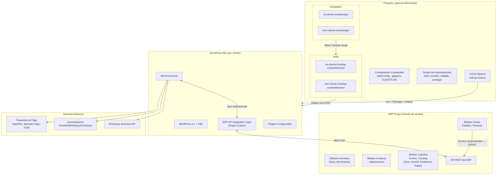
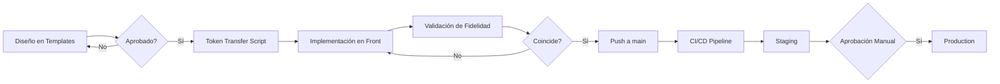
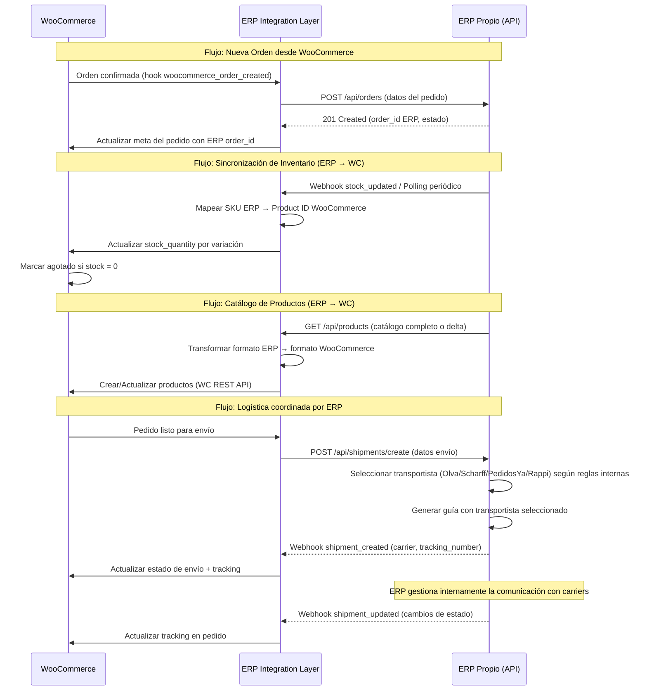
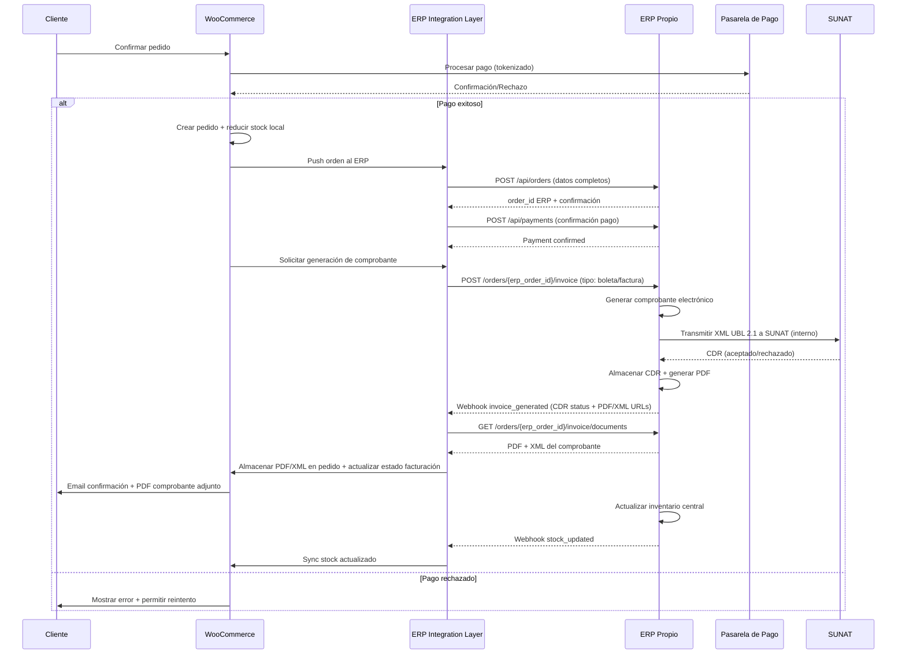
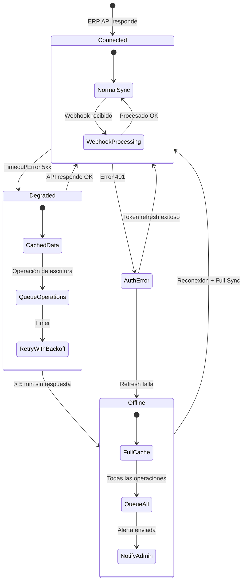

# Design Document: WordPress Web Agency Project

## Overview

Este documento describe la arquitectura técnica para un proyecto de agencia web que estructura un monorepo para la venta de sitios web construidos con WordPress + WooCommerce, orientado al mercado peruano. El sistema abarca desde la organización de plantillas de diseño hasta la implementación de temas WordPress con integraciones de comercio electrónico completas (pagos locales, facturación electrónica SUNAT, logística nacional, POS omnicanal).

### Decisiones Clave de Diseño

1. **Monorepo con dos módulos** (`templates/` y `front/`): Permite compartir configuraciones, mantener correspondencia 1:1 entre diseños e implementaciones, y simplificar CI/CD.
2. **WordPress FSE + theme.json como fuente única de tokens**: Elimina duplicación de estilos y aprovecha el sistema nativo de WordPress 6.x.
3. **ERP Propio como fuente de verdad**: El ERP del cliente es el sistema central que gestiona inventario, ventas, compras, logística (incluyendo coordinación con transportistas como Olva, Scharff, PedidosYa, Rappi) y facturación electrónica. WooCommerce actúa como canal de ventas que sincroniza bidireccionalmente con el ERP vía API.
4. **Integración por plugins oficiales + Capa de Integración ERP**: Para pagos se priorizan plugins certificados de pasarelas; para inventario, logística, ventas y facturación electrónica SUNAT se implementa una capa de integración que coordina WooCommerce con el ERP. El ERP es responsable de: (a) generar comprobantes electrónicos (boletas/facturas), transmitirlos a SUNAT y devolver el CDR/PDF a WooCommerce vía API; (b) gestionar toda la logística de envíos — selección de transportista, cálculo de tarifas, generación de guías y tracking — comunicándose internamente con Olva, Scharff, PedidosYa y Rappi. WooCommerce NO se conecta directamente con proveedores logísticos.
5. **Scripts de automatización en PowerShell/Node**: Para transferencia de tokens, validación de estructura y empaquetado de templates.
6. **CI/CD con GitHub Actions**: Pipeline multi-entorno (staging/production) con validaciones de código y health checks.

---

## Architecture

### Diagrama de Alto Nivel



### Diagrama de Flujo de Trabajo



### Diagrama de Flujo de Integración ERP



---

## Components and Interfaces

### 1. Módulo de Estructura del Monorepo

**Responsabilidad**: Organizar el código fuente, validar convenciones de nombres y mantener el registro de clientes.

```
proyecto-agencia/
├── templates/                    # Módulo_Templates
│   ├── [categoria]/              # Agrupación opcional por negocio
│   │   └── [hostname]/
│   │       ├── design/
│   │       │   ├── code.html     # Mockup HTML
│   │       │   ├── DESIGN.md     # Tokens de diseño (YAML frontmatter)
│   │       │   └── screen.png    # Captura del diseño
│   │       └── components/       # Opcional: plantillas empaquetables
│   │           ├── index.html
│   │           ├── template.manifest.json
│   │           ├── partials/
│   │           └── styles/
├── front/                        # Módulo_Front
│   ├── [categoria]/
│   │   └── [hostname]/
│   │       └── wp-content/
│   │           └── themes/
│   │               └── [theme-name]/
│   │                   ├── style.css
│   │                   ├── functions.php
│   │                   ├── theme.json
│   │                   ├── templates/
│   │                   ├── parts/
│   │                   ├── patterns/
│   │                   └── assets/
├── scripts/                      # Scripts de automatización
│   ├── validate-structure.ps1
│   ├── transfer-tokens.js
│   ├── compare-screenshots.js
│   └── package-template.ps1
├── .github/
│   └── workflows/
│       ├── deploy-staging.yml
│       └── deploy-production.yml
├── .editorconfig
├── .gitignore
├── CLIENTS.md                    # Registro central de clientes
├── WORKFLOW.md                   # Flujo de trabajo documentado
├── PLUGINS.md                    # Plugins recomendados
└── README.md
```

### 2. Script de Validación de Estructura (`validate-structure.ps1`)

**Interfaz**:
```powershell
# Entrada: ruta del monorepo, nombre de hostname candidato
# Salida: resultado de validación (pass/fail con mensajes)

param(
    [string]$MonorepoRoot,
    [string]$Hostname,
    [switch]$ValidateAll
)
```

**Reglas de validación**:
- Hostname: lowercase, alfanumérico + guiones, máximo 63 chars por segmento, con TLD
- Archivos requeridos en `design/`: `code.html`, `DESIGN.md`, `screen.png`
- Correspondencia 1:1 entre `templates/` y `front/` para clientes con tema

### 3. Script de Transferencia de Tokens (`transfer-tokens.js`)

**Interfaz**:
```typescript
interface TokenTransferInput {
  designMdPath: string;    // Ruta al DESIGN.md del cliente
  themeJsonPath: string;   // Ruta al theme.json destino
  overwrite?: boolean;     // Si sobreescribir valores existentes
}

interface TokenTransferResult {
  success: boolean;
  tokensTransferred: number;
  warnings: string[];
  errors: string[];
}

function transferTokens(input: TokenTransferInput): TokenTransferResult;
```

**Mapeo de tokens DESIGN.md → theme.json**:

| DESIGN.md (YAML)         | theme.json path                              |
|--------------------------|----------------------------------------------|
| `colors.*`               | `settings.color.palette[].color`             |
| `typography.*.fontFamily` | `settings.typography.fontFamilies[].fontFamily` |
| `typography.*.fontSize`  | `settings.typography.fontSizes[].size`        |
| `spacing.base`           | `settings.spacing.units`                     |
| `rounded.*`              | `styles.blocks.*.border.radius`              |

### 4. Script de Comparación Visual (`compare-screenshots.js`)

**Interfaz**:
```typescript
interface CompareInput {
  designScreenshot: string;  // Ruta a screen.png del diseño
  implementationUrl: string; // URL del tema implementado (o screenshot generado)
  threshold?: number;        // Umbral de diferencia aceptable (0-1)
}

interface CompareResult {
  match: boolean;
  diffPercentage: number;
  diffImagePath: string;     // Imagen con diferencias resaltadas
  dimensions: {
    design: { width: number; height: number };
    implementation: { width: number; height: number };
  };
}
```

### 5. Tema WordPress (Estructura del Componente)

**Interfaz del tema** (`functions.php`):
```php
<?php
// Declaración de soporte
add_theme_support('woocommerce');
add_theme_support('wp-block-styles');
add_theme_support('editor-styles');
add_theme_support('responsive-embeds');

// Registro de block patterns
function register_theme_patterns() {
    register_block_pattern('theme/hero', [...]);
    register_block_pattern('theme/product-catalog', [...]);
    register_block_pattern('theme/testimonials', [...]);
    register_block_pattern('theme/footer', [...]);
    // Mínimo 5 patterns para el cliente
}

// Restricción de bloques para rol cliente
function restrict_blocks_for_client_role($allowed_blocks, $editor_context) {
    if (current_user_can('client_role')) {
        return get_theme_registered_blocks();
    }
    return $allowed_blocks;
}

// Desactivar meta tags propios si plugin SEO activo
function conditional_seo_output() {
    if (is_plugin_active('wordpress-seo/wp-seo.php') || 
        is_plugin_active('seo-by-rank-math/rank-math.php')) {
        return; // Plugin SEO maneja meta tags
    }
    output_basic_meta_tags();
}
```

### 6. Pipeline CI/CD (GitHub Actions)

**Interfaz del workflow**:
```yaml
# .github/workflows/deploy.yml
name: Deploy WordPress Theme
on:
  push:
    branches: [main]
    paths: ['front/**']

jobs:
  validate:
    # PHP_CodeSniffer, PHP 8.1+ compatibility
  package:
    # Crear ZIP del tema
  deploy-staging:
    # SFTP/SSH al servidor staging
  health-check:
    # Verificar HTTP 200 en < 30s
  deploy-production:
    # Manual approval + deploy
    environment: production
```

### 7. Componente WhatsApp Button

**Interfaz**:
```php
<?php
// Configuración desde admin
interface WhatsAppConfig {
    phone_number: string;       // Formato internacional +51...
    product_message: string;    // Template con {product_name} y {product_url}
    generic_message: string;    // Mensaje genérico
    excluded_pages: int[];      // IDs de páginas donde ocultar
}

// Renderizado frontend
function render_whatsapp_button(): string {
    // Retorna HTML del botón flotante con:
    // - Posición fixed bottom-right
    // - z-index alto (9999)
    // - Área de toque 48x48px mínimo
    // - Enlace wa.me con mensaje contextual
}
```

### 8. Método de Envío ERP (ERPShippingMethod)

**Responsabilidad**: Proveer un único método de envío en WooCommerce que consulta al ERP para obtener tarifas de transportistas disponibles. WooCommerce NO se conecta directamente con proveedores logísticos (Olva, Scharff, PedidosYa, Rappi) — toda la coordinación con carriers es responsabilidad del módulo de logística del ERP.

**Flujo de shipping**:
1. En checkout, WooCommerce llama al ERP vía `getShippingRates()` para obtener tarifas disponibles
2. El ERP consulta internamente a sus transportistas configurados y devuelve opciones con carrier, precio y tiempo estimado
3. El cliente selecciona una opción de envío en checkout
4. Tras confirmar el pedido, el ERP recibe la orden y gestiona internamente la asignación de carrier, generación de guía y tracking
5. WooCommerce recibe actualizaciones de tracking vía webhooks del ERP

**Interfaz**:
```php
<?php
/**
 * Método de envío único que consulta tarifas al ERP.
 * Reemplaza adaptadores individuales por carrier.
 */
class ERPShippingMethod extends WC_Shipping_Method {
    
    public function __construct() {
        $this->id = 'erp_shipping';
        $this->title = 'Envío coordinado por ERP';
        $this->method_title = 'ERP Shipping';
        $this->method_description = 'Obtiene tarifas de envío del módulo de logística del ERP';
    }
    
    /**
     * Calcula tarifas consultando al ERP.
     * El ERP internamente consulta a Olva, Scharff, PedidosYa, Rappi
     * y devuelve las opciones disponibles.
     */
    public function calculate_shipping($package = []) {
        $erpClient = ERPClientFactory::create();
        
        $request = new ShippingQuoteRequest(
            origin: get_option('erp_warehouse_code'),
            destination: [
                'department' => $package['destination']['state'],
                'province'   => $package['destination']['city'],
                'district'   => $package['destination']['address_2'] ?? '',
            ],
            weight_kg: $this->calculate_package_weight($package),
            dimensions: $this->calculate_package_dimensions($package)
        );
        
        try {
            $rates = $erpClient->getShippingRates($request);
            
            foreach ($rates as $rate) {
                $this->add_rate([
                    'id'    => 'erp_' . sanitize_title($rate->carrier . '_' . $rate->service),
                    'label' => sprintf('%s - %s (%d días)', $rate->carrier, $rate->service, $rate->estimated_days),
                    'cost'  => $rate->price,
                    'meta_data' => [
                        'erp_carrier' => $rate->carrier,
                        'erp_service' => $rate->service,
                        'estimated_days' => $rate->estimated_days,
                    ],
                ]);
            }
        } catch (ERPTimeoutException $e) {
            // Fallback: usar tarifas locales por zona
            $this->add_fallback_rates($package);
        }
    }
    
    /**
     * Tarifas de respaldo cuando el ERP no responde.
     * Configuradas localmente por zona geográfica.
     */
    private function add_fallback_rates(array $package): void {
        $zone = $this->determine_zone($package['destination']);
        $fallback_rates = get_option('erp_shipping_fallback_rates', []);
        
        if (isset($fallback_rates[$zone])) {
            $this->add_rate([
                'id'    => 'erp_fallback_' . $zone,
                'label' => 'Envío estándar (tarifa estimada)',
                'cost'  => $fallback_rates[$zone],
                'meta_data' => ['is_fallback' => true],
            ]);
        }
    }
    
    private function determine_zone(array $destination): string;
    private function calculate_package_weight(array $package): float;
    private function calculate_package_dimensions(array $package): array;
}
```

**Nota**: No existen adaptadores individuales (OlvaAdapter, ScharffAdapter, PedidosYaAdapter, RappiAdapter). El ERP maneja toda la comunicación directa con los proveedores logísticos a través de su módulo de transporte y logística.

### 9. Capa de Integración ERP (ERP API Integration Layer)

**Responsabilidad**: Gestionar la comunicación bidireccional entre WooCommerce y el ERP propio del cliente. Actúa como middleware que traduce datos entre ambos sistemas, maneja la sincronización, resuelve conflictos y garantiza consistencia eventual.

**Principios de diseño**:
- El ERP es la **fuente de verdad** para inventario, precios, catálogo y estado de pedidos
- WooCommerce es un **canal de ventas** que empuja órdenes al ERP y consume datos del ERP
- La comunicación es **bidireccional asíncrona** con reconciliación periódica
- Los conflictos se resuelven con **ERP-wins** (el ERP siempre tiene prioridad)

**Interfaz principal del plugin**:
```php
<?php
namespace AgenciaERP;

/**
 * Plugin principal de integración ERP
 * Plugin Name: WooCommerce ERP Integration
 * Description: Capa de integración bidireccional con ERP propio
 */

interface ERPClientInterface {
    // Conexión y autenticación
    public function authenticate(): AuthToken;
    public function healthCheck(): HealthStatus;
    
    // Productos y Catálogo (ERP → WooCommerce)
    public function getProducts(array $filters = [], ?string $since = null): ProductCollection;
    public function getProductBySku(string $sku): ?ERPProduct;
    public function getStockLevels(array $skus = []): StockCollection;
    public function getPrices(array $skus = []): PriceCollection;
    
    // Pedidos (WooCommerce → ERP)
    public function createOrder(OrderPayload $order): ERPOrderResponse;
    public function updateOrderStatus(string $erpOrderId, string $status): bool;
    public function confirmPayment(string $erpOrderId, PaymentConfirmation $payment): bool;
    
    // Logística (ERP → WooCommerce)
    public function getShipmentStatus(string $erpOrderId): ShipmentStatus;
    public function getShippingRates(ShippingQuoteRequest $request): ShippingRateCollection;
    
    // Facturación Electrónica (WooCommerce → ERP → SUNAT)
    public function requestInvoice(string $erpOrderId, string $invoiceType): InvoiceRequestResponse;
    public function getInvoiceStatus(string $erpOrderId): InvoiceStatus;
    public function getInvoiceDocuments(string $erpOrderId): InvoiceDocuments;
    
    // Clientes (WooCommerce → ERP)
    public function syncCustomer(CustomerPayload $customer): ERPCustomerResponse;
}

/**
 * Servicio de sincronización
 */
class SyncService {
    private ERPClientInterface $erpClient;
    private ConflictResolver $conflictResolver;
    private SyncQueue $queue;
    private SyncLogger $logger;
    
    // Sync de inventario (ERP → WC)
    public function syncStock(): SyncResult;
    
    // Sync de catálogo (ERP → WC)
    public function syncProducts(bool $fullSync = false): SyncResult;
    
    // Sync de precios (ERP → WC)
    public function syncPrices(): SyncResult;
    
    // Push de orden (WC → ERP)
    public function pushOrder(int $wcOrderId): PushResult;
    
    // Push de cliente (WC → ERP)
    public function pushCustomer(int $wcCustomerId): PushResult;
    
    // Reconciliación completa
    public function fullReconciliation(): ReconciliationReport;
}

/**
 * Resolución de conflictos
 */
class ConflictResolver {
    // Estrategia: ERP siempre gana en datos de inventario/precios
    public function resolveStockConflict(int $wcStock, int $erpStock, string $sku): int;
    
    // Estrategia: Merge para datos de cliente (WC puede tener datos más recientes de contacto)
    public function resolveCustomerConflict(array $wcData, array $erpData): array;
    
    // Estrategia: ERP gana en estado de pedido (excepto pago que viene de WC)
    public function resolveOrderConflict(string $wcStatus, string $erpStatus, string $orderId): string;
}

/**
 * Cola de sincronización para operaciones fallidas
 */
class SyncQueue {
    public function enqueue(SyncOperation $operation): void;
    public function processQueue(int $batchSize = 50): QueueResult;
    public function getFailedOperations(): array;
    public function retryFailed(int $maxRetries = 3): RetryResult;
}
```

**Configuración del plugin** (admin panel):
```php
<?php
// Opciones configurables desde WordPress Admin
$erp_settings = [
    'erp_api_base_url'       => 'https://erp.cliente.com/api/v1',
    'erp_api_key'            => '***',           // Almacenado encriptado
    'erp_api_secret'         => '***',           // Almacenado encriptado
    'sync_interval_stock'    => 300,             // Segundos (5 min por defecto)
    'sync_interval_products' => 3600,            // Segundos (1 hora por defecto)
    'sync_interval_prices'   => 1800,            // Segundos (30 min por defecto)
    'webhook_secret'         => '***',           // Para validar webhooks del ERP
    'conflict_strategy'      => 'erp_wins',      // erp_wins | manual_review
    'retry_max_attempts'     => 3,
    'retry_backoff_seconds'  => [30, 120, 600],  // Backoff exponencial
    'batch_size'             => 50,              // Productos por lote de sync
    'log_level'              => 'info',          // debug | info | warning | error
    'enable_webhooks'        => true,            // Recibir webhooks del ERP
    'fallback_on_failure'    => true,            // Usar datos cacheados si ERP no responde
];
```

**Hooks de WooCommerce interceptados**:
```php
<?php
// Eventos WC que disparan comunicación con ERP
add_action('woocommerce_new_order', [$syncService, 'pushOrder']);
add_action('woocommerce_payment_complete', [$syncService, 'confirmPaymentToERP']);
add_action('woocommerce_order_status_changed', [$syncService, 'syncOrderStatus']);
add_action('woocommerce_created_customer', [$syncService, 'pushCustomer']);
add_action('woocommerce_update_customer', [$syncService, 'pushCustomer']);

// Cron jobs para sincronización periódica
add_action('erp_sync_stock_cron', [$syncService, 'syncStock']);
add_action('erp_sync_products_cron', [$syncService, 'syncProducts']);
add_action('erp_sync_prices_cron', [$syncService, 'syncPrices']);

// Webhook endpoint para recibir actualizaciones del ERP
add_action('rest_api_init', function() {
    register_rest_route('erp-integration/v1', '/webhook', [
        'methods'  => 'POST',
        'callback' => [$webhookHandler, 'handle'],
        'permission_callback' => [$webhookHandler, 'validateSignature'],
    ]);
});
```

### 10. Integración de Pagos y Facturación

**Flujo de pago y facturación (con ERP)**:


---

## Data Models

### Modelo: Registro de Cliente (`CLIENTS.md` / `clients.json`)

```json
{
  "clients": [
    {
      "name": "Mi Cliente",
      "hostname": "mi-cliente.local",
      "category": "ecommerce",
      "status": "desarrollo",
      "templatePath": "templates/ecommerce/mi-cliente.local/",
      "frontPath": "front/ecommerce/mi-cliente.local/",
      "createdAt": "2024-01-15",
      "updatedAt": "2024-03-20"
    }
  ],
  "statusValues": ["diseño", "desarrollo", "revisión", "producción", "archivado"],
  "categories": ["ecommerce", "portafolio", "landing-page"]
}
```

**Restricciones**:
- `hostname`: formato de dominio válido (lowercase, alfanumérico + guiones + puntos, max 253 chars)
- `status`: enum limitado a los 5 valores definidos
- `category`: lowercase sin espacios
- Clientes con status `archivado` se excluyen de listados activos

### Modelo: Design System Tokens (`DESIGN.md` YAML frontmatter)

```yaml
---
name: string                    # Nombre del sistema de diseño
colors:
  primary: string               # Color primario (hex)
  on-primary: string            # Color sobre primario
  secondary: string             # Color secundario
  # ... Material Design 3 tokens
typography:
  display-lg:
    fontFamily: string
    fontSize: string            # Con unidad (px, rem)
    fontWeight: string
    lineHeight: string
    letterSpacing: string       # Opcional
  # ... escalas tipográficas
spacing:
  base: string                  # Unidad base (ej: 8px)
  gutter: string
  margin-mobile: string
  margin-desktop: string
  max-width: string
rounded:
  sm: string
  DEFAULT: string
  md: string
  lg: string
  xl: string
  full: string
---
```

### Modelo: theme.json (WordPress FSE)

```json
{
  "$schema": "https://schemas.wp.org/wp/6.5/theme.json",
  "version": 2,
  "settings": {
    "color": {
      "custom": false,
      "palette": [
        { "slug": "primary", "color": "#006e01", "name": "Primary" },
        { "slug": "on-primary", "color": "#ffffff", "name": "On Primary" }
      ]
    },
    "typography": {
      "customFontSize": false,
      "fontFamilies": [
        {
          "fontFamily": "IBM Plex Serif, serif",
          "slug": "heading",
          "name": "Heading"
        },
        {
          "fontFamily": "Open Sans, sans-serif",
          "slug": "body",
          "name": "Body"
        }
      ],
      "fontSizes": [
        { "slug": "small", "size": "14px", "name": "Small" },
        { "slug": "medium", "size": "16px", "name": "Medium" },
        { "slug": "large", "size": "18px", "name": "Large" }
      ]
    },
    "spacing": {
      "customSpacingSize": false,
      "spacingSizes": [
        { "slug": "10", "size": "8px", "name": "Base" },
        { "slug": "20", "size": "16px", "name": "Small" },
        { "slug": "30", "size": "24px", "name": "Medium" }
      ]
    },
    "layout": {
      "contentSize": "1280px",
      "wideSize": "1440px"
    }
  },
  "styles": {
    "color": { "background": "#f9f9f9", "text": "#1a1c1c" },
    "typography": { "fontFamily": "var(--wp--preset--font-family--body)" }
  }
}
```

### Modelo: Producto Variable WooCommerce

```json
{
  "product": {
    "name": "Zapatilla Running Pro",
    "type": "variable",
    "categories": [
      { "id": 1, "name": "Zapatillas", "parent": null },
      { "id": 5, "name": "Running", "parent": 1 }
    ],
    "attributes": [
      {
        "name": "Talla",
        "options": ["36", "37", "38", "39", "40", "41", "42"],
        "variation": true,
        "visible": true
      },
      {
        "name": "Color",
        "options": ["Negro", "Blanco", "Azul"],
        "variation": true,
        "visible": true
      }
    ],
    "variations": [
      {
        "attributes": { "talla": "38", "color": "Negro" },
        "regular_price": "299.90",
        "sale_price": "249.90",
        "stock_quantity": 15,
        "image": { "src": "zapatilla-negro.webp" }
      }
    ],
    "images": [
      { "src": "zapatilla-principal.webp", "position": 0 },
      { "src": "zapatilla-lateral.webp", "position": 1 }
    ]
  }
}
```

### Modelo: Configuración de Flujos de Automatización

```json
{
  "automation_flows": [
    {
      "name": "Recuperación de Carrito Abandonado",
      "trigger": "cart_abandoned",
      "delay": "1h",
      "sequence": [
        { "step": 1, "action": "send_email", "template": "cart_reminder_1", "delay": "0" },
        { "step": 2, "action": "send_email", "template": "cart_reminder_2", "delay": "24h" },
        { "step": 3, "action": "send_email", "template": "cart_final_offer", "delay": "48h" }
      ],
      "configurable": ["delay", "sequence_count", "email_templates"]
    },
    {
      "name": "Cupón Primera Compra",
      "trigger": "order_completed_first",
      "delay": "5min",
      "action": "send_email",
      "template": "first_purchase_coupon"
    },
    {
      "name": "Felicitación Cumpleaños",
      "trigger": "birthday",
      "delay": "-24h",
      "action": "send_email",
      "template": "birthday_greeting"
    },
    {
      "name": "Reactivación de Clientes Inactivos",
      "trigger": "customer_inactive",
      "inactivity_period": "30d",
      "frequency": "30d",
      "action": "send_email",
      "template": "reactivation_offer"
    }
  ]
}
```

### Modelo: Contrato de API del ERP Propio

```json
{
  "erp_integration": {
    "name": "ERP Propio del Cliente",
    "base_url": "https://erp.cliente.com/api/v1",
    "version": "1.0.0",
    "authentication": {
      "type": "api_key_header",
      "header_name": "X-ERP-API-Key",
      "credentials": ["ERP_API_KEY", "ERP_API_SECRET"],
      "token_refresh": {
        "endpoint": "/auth/refresh",
        "expiry_seconds": 3600
      }
    },
    "endpoints": {
      "products": {
        "list": {
          "method": "GET",
          "path": "/products",
          "query_params": {
            "since": "ISO 8601 datetime (delta sync)",
            "page": "integer",
            "per_page": "integer (max 100)",
            "category": "string (optional)"
          },
          "response_schema": {
            "data": [{
              "sku": "string (unique identifier)",
              "name": "string",
              "description": "string",
              "category_path": "string[] (hierarchical)",
              "attributes": {
                "sizes": "string[]",
                "colors": "string[]"
              },
              "variations": [{
                "sku_variation": "string",
                "size": "string",
                "color": "string",
                "price": "decimal",
                "sale_price": "decimal | null",
                "stock_quantity": "integer",
                "images": "string[] (URLs)"
              }],
              "status": "active | inactive | discontinued",
              "updated_at": "ISO 8601"
            }],
            "pagination": {
              "total": "integer",
              "page": "integer",
              "per_page": "integer",
              "total_pages": "integer"
            }
          },
          "timeout_ms": 10000,
          "rate_limit": "60/min"
        },
        "get_stock": {
          "method": "GET",
          "path": "/products/stock",
          "query_params": {
            "skus": "string[] (comma-separated, max 100)"
          },
          "response_schema": {
            "data": [{
              "sku": "string",
              "stock_quantity": "integer",
              "reserved": "integer",
              "available": "integer",
              "warehouse": "string",
              "updated_at": "ISO 8601"
            }]
          },
          "timeout_ms": 5000,
          "rate_limit": "120/min"
        },
        "get_prices": {
          "method": "GET",
          "path": "/products/prices",
          "query_params": {
            "skus": "string[] (comma-separated, max 100)",
            "price_list": "string (default: 'web')"
          },
          "response_schema": {
            "data": [{
              "sku": "string",
              "regular_price": "decimal",
              "sale_price": "decimal | null",
              "sale_start": "ISO 8601 | null",
              "sale_end": "ISO 8601 | null",
              "currency": "PEN",
              "tax_included": "boolean"
            }]
          },
          "timeout_ms": 5000,
          "rate_limit": "120/min"
        }
      },
      "orders": {
        "create": {
          "method": "POST",
          "path": "/orders",
          "request_schema": {
            "external_id": "string (WC order ID)",
            "channel": "woocommerce",
            "customer": {
              "external_id": "string (WC customer ID)",
              "name": "string",
              "email": "string",
              "phone": "string",
              "document_type": "DNI | RUC | CE",
              "document_number": "string"
            },
            "shipping_address": {
              "address_1": "string",
              "address_2": "string | null",
              "city": "string",
              "state": "string (departamento)",
              "postcode": "string",
              "country": "PE"
            },
            "items": [{
              "sku": "string",
              "quantity": "integer",
              "unit_price": "decimal",
              "subtotal": "decimal"
            }],
            "totals": {
              "subtotal": "decimal",
              "tax": "decimal",
              "shipping": "decimal",
              "total": "decimal"
            },
            "payment": {
              "method": "string",
              "transaction_id": "string",
              "status": "paid | pending"
            },
            "notes": "string | null"
          },
          "response_schema": {
            "erp_order_id": "string",
            "status": "received | processing | error",
            "created_at": "ISO 8601",
            "errors": "string[] | null"
          },
          "timeout_ms": 10000,
          "rate_limit": "30/min"
        },
        "confirm_payment": {
          "method": "POST",
          "path": "/orders/{erp_order_id}/payment",
          "request_schema": {
            "transaction_id": "string",
            "amount": "decimal",
            "currency": "PEN",
            "method": "string",
            "confirmed_at": "ISO 8601"
          },
          "response_schema": {
            "status": "confirmed | rejected",
            "invoice_number": "string | null"
          },
          "timeout_ms": 5000
        },
        "get_status": {
          "method": "GET",
          "path": "/orders/{erp_order_id}/status",
          "response_schema": {
            "erp_order_id": "string",
            "status": "received | processing | shipped | delivered | cancelled",
            "shipment": {
              "carrier": "string | null",
              "tracking_number": "string | null",
              "estimated_delivery": "ISO 8601 | null",
              "events": [{
                "status": "string",
                "timestamp": "ISO 8601",
                "description": "string"
              }]
            },
            "updated_at": "ISO 8601"
          },
          "timeout_ms": 5000,
          "rate_limit": "60/min"
        }
      },
      "invoicing": {
        "request_invoice": {
          "method": "POST",
          "path": "/orders/{erp_order_id}/invoice",
          "request_schema": {
            "invoice_type": "boleta | factura",
            "customer_document_type": "DNI | RUC | CE",
            "customer_document_number": "string",
            "customer_name": "string",
            "customer_address": "string | null (required for factura)"
          },
          "response_schema": {
            "status": "queued | processing | error",
            "invoice_request_id": "string",
            "estimated_completion_seconds": "integer"
          },
          "timeout_ms": 10000,
          "rate_limit": "30/min"
        },
        "get_invoice_status": {
          "method": "GET",
          "path": "/orders/{erp_order_id}/invoice/status",
          "response_schema": {
            "erp_order_id": "string",
            "invoice_status": "pending | generated | accepted | rejected | error",
            "sunat_response_code": "string | null",
            "sunat_response_message": "string | null",
            "invoice_series": "string | null (e.g. B001, F001)",
            "invoice_number": "string | null",
            "generated_at": "ISO 8601 | null",
            "transmitted_at": "ISO 8601 | null"
          },
          "timeout_ms": 5000,
          "rate_limit": "60/min"
        },
        "get_invoice_documents": {
          "method": "GET",
          "path": "/orders/{erp_order_id}/invoice/documents",
          "response_schema": {
            "erp_order_id": "string",
            "pdf_url": "string (signed URL, expires in 1h)",
            "xml_url": "string (signed URL, expires in 1h)",
            "cdr_xml_url": "string | null (signed URL, SUNAT CDR)",
            "invoice_series": "string",
            "invoice_number": "string"
          },
          "timeout_ms": 5000,
          "rate_limit": "60/min"
        }
      },
      "customers": {
        "sync": {
          "method": "POST",
          "path": "/customers",
          "request_schema": {
            "external_id": "string (WC customer ID)",
            "name": "string",
            "email": "string",
            "phone": "string",
            "document_type": "DNI | RUC | CE",
            "document_number": "string",
            "addresses": "array"
          },
          "response_schema": {
            "erp_customer_id": "string",
            "status": "created | updated | merged"
          },
          "timeout_ms": 5000
        }
      },
      "shipments": {
        "get_rates": {
          "method": "POST",
          "path": "/shipments/rates",
          "description": "Obtiene tarifas de envío disponibles. El ERP consulta internamente a sus transportistas configurados (Olva, Scharff, PedidosYa, Rappi) y devuelve las opciones.",
          "request_schema": {
            "origin": "string (warehouse code)",
            "destination": {
              "department": "string",
              "province": "string",
              "district": "string"
            },
            "weight_kg": "decimal",
            "dimensions": {
              "length_cm": "decimal",
              "width_cm": "decimal",
              "height_cm": "decimal"
            }
          },
          "response_schema": {
            "rates": [{
              "carrier": "string (e.g. 'Olva Courier', 'Scharff', 'PedidosYa', 'Rappi')",
              "service": "string (e.g. 'express', 'standard', 'same_day')",
              "price": "decimal",
              "currency": "PEN",
              "estimated_days": "integer",
              "available": "boolean",
              "carrier_logo_url": "string | null"
            }]
          },
          "timeout_ms": 8000,
          "rate_limit": "60/min"
        },
        "create": {
          "method": "POST",
          "path": "/shipments/create",
          "description": "Solicita al ERP crear un envío para un pedido. El ERP selecciona el transportista según sus reglas internas (o usa el carrier preferido indicado) y gestiona la generación de guía.",
          "request_schema": {
            "erp_order_id": "string",
            "preferred_carrier": "string | null (optional, ERP may override based on rules)",
            "preferred_service": "string | null (optional)",
            "shipping_address": {
              "recipient_name": "string",
              "phone": "string",
              "address_1": "string",
              "address_2": "string | null",
              "district": "string",
              "province": "string",
              "department": "string",
              "postcode": "string",
              "country": "PE",
              "reference": "string | null"
            },
            "package": {
              "weight_kg": "decimal",
              "length_cm": "decimal",
              "width_cm": "decimal",
              "height_cm": "decimal",
              "declared_value": "decimal"
            },
            "notes": "string | null"
          },
          "response_schema": {
            "shipment_id": "string (ERP internal shipment ID)",
            "status": "created | processing | error",
            "carrier": "string (assigned carrier: Olva, Scharff, PedidosYa, Rappi)",
            "tracking_number": "string | null (may be generated async)",
            "label_url": "string | null (may be available async)",
            "estimated_delivery": "ISO 8601 | null",
            "created_at": "ISO 8601"
          },
          "timeout_ms": 15000,
          "rate_limit": "30/min"
        },
        "get_tracking": {
          "method": "GET",
          "path": "/shipments/{erp_order_id}/tracking",
          "description": "Obtiene información de tracking de un envío. El ERP consulta internamente al transportista asignado y devuelve el estado actualizado.",
          "response_schema": {
            "erp_order_id": "string",
            "shipment_id": "string",
            "carrier": "string (Olva, Scharff, PedidosYa, Rappi)",
            "tracking_number": "string",
            "tracking_url": "string (URL pública de tracking del carrier)",
            "status": "pending | picked_up | in_transit | out_for_delivery | delivered | returned | failed",
            "estimated_delivery": "ISO 8601 | null",
            "events": [{
              "status": "string",
              "timestamp": "ISO 8601",
              "description": "string",
              "location": "string | null"
            }],
            "updated_at": "ISO 8601"
          },
          "timeout_ms": 8000,
          "rate_limit": "60/min"
        }
      }
    },
    "webhooks": {
      "stock_updated": {
        "payload": {
          "event": "stock_updated",
          "data": [{
            "sku": "string",
            "new_quantity": "integer",
            "previous_quantity": "integer",
            "reason": "sale | return | adjustment | restock"
          }],
          "timestamp": "ISO 8601"
        }
      },
      "order_status_changed": {
        "payload": {
          "event": "order_status_changed",
          "data": {
            "erp_order_id": "string",
            "external_id": "string (WC order ID)",
            "old_status": "string",
            "new_status": "string",
            "shipment": "object | null"
          },
          "timestamp": "ISO 8601"
        }
      },
      "shipment_created": {
        "payload": {
          "event": "shipment_created",
          "data": {
            "erp_order_id": "string",
            "external_id": "string (WC order ID)",
            "shipment_id": "string",
            "carrier": "string (Olva Courier | Scharff | PedidosYa | Rappi)",
            "service": "string",
            "tracking_number": "string",
            "tracking_url": "string",
            "label_url": "string | null",
            "estimated_delivery": "ISO 8601 | null"
          },
          "timestamp": "ISO 8601"
        }
      },
      "shipment_updated": {
        "payload": {
          "event": "shipment_updated",
          "data": {
            "erp_order_id": "string",
            "external_id": "string (WC order ID)",
            "shipment_id": "string",
            "carrier": "string",
            "tracking_number": "string",
            "status": "picked_up | in_transit | out_for_delivery | delivered | returned | failed",
            "event_description": "string",
            "event_location": "string | null"
          },
          "timestamp": "ISO 8601"
        }
      },
      "price_updated": {
        "payload": {
          "event": "price_updated",
          "data": [{
            "sku": "string",
            "new_price": "decimal",
            "new_sale_price": "decimal | null"
          }],
          "timestamp": "ISO 8601"
        }
      },
      "invoice_generated": {
        "payload": {
          "event": "invoice_generated",
          "data": {
            "erp_order_id": "string",
            "external_id": "string (WC order ID)",
            "invoice_type": "boleta | factura",
            "invoice_series": "string (e.g. B001, F001)",
            "invoice_number": "string",
            "sunat_status": "accepted | rejected",
            "sunat_response_code": "string",
            "sunat_response_message": "string",
            "pdf_url": "string (signed URL)",
            "xml_url": "string (signed URL)",
            "cdr_xml_url": "string | null"
          },
          "timestamp": "ISO 8601"
        }
      }
    },
    "error_codes": {
      "400": "Datos de request inválidos",
      "401": "API key inválida o expirada",
      "404": "Recurso no encontrado (SKU, order_id)",
      "409": "Conflicto de datos (ej: orden duplicada)",
      "422": "Entidad no procesable (validación de negocio)",
      "429": "Rate limit excedido",
      "500": "Error interno del ERP",
      "503": "ERP en mantenimiento"
    },
    "sla": {
      "uptime": "99.0%",
      "response_time_p95": "5000ms",
      "maintenance_window": "Domingos 02:00-04:00 PET"
    },
    "sync_strategy": {
      "stock": {
        "method": "webhook + polling fallback",
        "polling_interval_seconds": 300,
        "direction": "ERP → WooCommerce"
      },
      "products": {
        "method": "polling (delta sync by updated_at)",
        "polling_interval_seconds": 3600,
        "direction": "ERP → WooCommerce"
      },
      "prices": {
        "method": "webhook + polling fallback",
        "polling_interval_seconds": 1800,
        "direction": "ERP → WooCommerce"
      },
      "orders": {
        "method": "event-driven (WC hooks)",
        "direction": "WooCommerce → ERP"
      },
      "order_status": {
        "method": "webhook from ERP",
        "direction": "ERP → WooCommerce"
      },
      "invoicing": {
        "method": "event-driven (WC requests invoice after payment) + webhook for completion",
        "direction": "WooCommerce → ERP (request) / ERP → WooCommerce (result via webhook)"
      }
    }
  }
}
```

### Modelo: Registro de Sincronización ERP

```json
{
  "sync_log_entry": {
    "id": "uuid",
    "timestamp": "ISO 8601",
    "direction": "erp_to_wc | wc_to_erp",
    "entity_type": "product | stock | price | order | customer",
    "entity_id": "string (SKU or order ID)",
    "operation": "create | update | delete",
    "status": "success | failed | queued | retrying",
    "attempt": 1,
    "max_attempts": 3,
    "request_payload": {},
    "response_payload": {},
    "error_message": "string | null",
    "error_code": "string | null",
    "duration_ms": 245,
    "next_retry_at": "ISO 8601 | null"
  }
}
```

---


## Correctness Properties

*A property is a characteristic or behavior that should hold true across all valid executions of a system — essentially, a formal statement about what the system should do. Properties serve as the bridge between human-readable specifications and machine-verifiable correctness guarantees.*

### Property 1: Hostname Validation Correctness

*For any* string input, the hostname validation function SHALL accept it if and only if it consists of lowercase alphanumeric characters and hyphens, with segments no longer than 63 characters, a total length no greater than 253 characters, and includes a valid TLD — and SHALL reject all other strings with an appropriate error message.

**Validates: Requirements 1.4, 1.6, 2.1, 3.1**

### Property 2: Design Directory Structure Validation

*For any* client directory containing a subset of the required files (`code.html`, `DESIGN.md`, `screen.png`), the structure validation function SHALL report exactly the set of missing files — reporting no errors when all files are present, and listing precisely the absent files when any are missing.

**Validates: Requirements 2.2, 2.3**

### Property 3: Template Packaging Inclusion/Exclusion

*For any* `components/` directory containing a mix of template files (HTML, manifest, partials, styles) and example/documentation files, the packaging script SHALL produce a ZIP that includes all template files and excludes all example files (`.example.json`, `README.md`), with the ZIP contents being a strict subset of the components directory minus excluded patterns.

**Validates: Requirements 2.5**

### Property 4: Token Transfer Round Trip

*For any* valid DESIGN.md containing color, typography, and spacing tokens in YAML frontmatter, the token transfer script SHALL produce a theme.json where every token from the DESIGN.md can be recovered by reading the corresponding theme.json path — i.e., `extractTokens(generateThemeJson(parseDesignMd(input))) ≡ parseDesignMd(input)` for all mapped token categories.

**Validates: Requirements 3.4, 11.2**

### Property 5: Token Discrepancy Detection

*For any* pair of DESIGN.md and theme.json with known token differences, the validation script SHALL report exactly the set of discrepant tokens — listing each token with its expected value (from DESIGN.md) and actual value (from theme.json), reporting "PASS" when all tokens match and "FAIL" when at least one differs.

**Validates: Requirements 11.4**

### Property 6: Client Registry Entry Validation

*For any* client registry entry, the validation function SHALL accept it if and only if it contains all required fields (name, hostname, category, status, templatePath, frontPath) with `status` being one of exactly five values (`diseño`, `desarrollo`, `revisión`, `producción`, `archivado`) and `hostname` passing hostname format validation — and SHALL reject entries with missing fields or invalid status values.

**Validates: Requirements 6.2, 6.4**

### Property 7: Client Registry Lookup Correctness

*For any* client registry with more than 10 entries and any search query (by name, category, or status), the lookup function SHALL return exactly the set of clients matching the query — no false positives and no false negatives.

**Validates: Requirements 6.3**

### Property 8: Archived Client Exclusion

*For any* client registry containing a mix of active and archived clients, the active listing function SHALL return only clients whose status is NOT `archivado` — the count of active results plus the count of archived clients SHALL equal the total client count.

**Validates: Requirements 6.6**

### Property 9: Product Filter Conjunction

*For any* product catalog and any combination of applied filters (type, size, gender, color, brand, price range), the filtered result set SHALL contain only products that satisfy ALL applied filters simultaneously — every product in the result must pass each individual filter predicate, and every product not in the result must fail at least one filter predicate.

**Validates: Requirements 16.2, 16.3**

### Property 10: Variable Product Invariants

*For any* variable product with variations defined by size and color combinations, selecting a color SHALL display only sizes with stock > 0 for that color, and any variation with stock = 0 SHALL be marked as unavailable and unselectable — the set of available sizes for a color equals exactly the set of variations for that color with positive stock.

**Validates: Requirements 16.5, 16.6, 16.7**

### Property 11: Cart Addition Validation

*For any* variable product and any add-to-cart attempt, the operation SHALL succeed if and only if both a valid size and a valid color have been selected AND the corresponding variation has stock > 0 — all other attempts SHALL be rejected with a validation message indicating the missing or invalid selections.

**Validates: Requirements 17.1, 17.2**

### Property 12: Cart Calculation Correctness

*For any* cart state containing items with quantities and prices, modifying any item's quantity SHALL result in: (a) the line subtotal equaling quantity × unit price for that item, (b) the cart total equaling the sum of all line subtotals plus taxes plus shipping, and (c) no quantity exceeding the available stock of its variation — quantities requested above stock SHALL be capped at the maximum available.

**Validates: Requirements 17.4, 17.5**

### Property 13: Cart State Preservation on Payment Failure

*For any* cart state and checkout form data, if a payment attempt fails or is rejected, the system SHALL preserve all cart items (with their quantities, sizes, colors) and all form field values identically to their pre-attempt state — no data loss shall occur from a failed payment.

**Validates: Requirements 17.10**

### Property 14: WhatsApp Message Generation

*For any* product page with a product name and URL, the WhatsApp button SHALL generate a message link containing both the product name and the product URL — and for any non-product page, SHALL generate a link with the configured generic message template.

**Validates: Requirements 18.3, 18.4**

### Property 15: ERP Order Mapping Completeness

*For any* valid WooCommerce order containing items, customer data, shipping address, and payment information, the ERP order mapper SHALL produce a payload where every required ERP field (external_id, customer, items with SKU/quantity/price, totals, payment) is present and correctly mapped from the source order — no required field shall be null or missing.

**Validates: Requirements 15.3, 17.7**

### Property 16: ERP Stock Sync Convergence (ERP-Wins)

*For any* product SKU and any stock value reported by the ERP (via webhook or polling), after the sync operation completes, the WooCommerce stock_quantity for that SKU SHALL equal exactly the ERP-reported value — regardless of what the previous WooCommerce stock value was.

**Validates: Requirements 15.3, 15.5, 15.7**

### Property 17: ERP Price Sync Consistency

*For any* product SKU and any price data (regular_price, sale_price) reported by the ERP, after the price sync operation completes, the WooCommerce product prices SHALL match the ERP values exactly — the ERP is the authoritative source for pricing.

**Validates: Requirements 16.4, 16.5**

### Property 18: Sync Queue Round Trip (No Data Loss)

*For any* sync operation that fails and is enqueued for retry, reading the operation back from the queue SHALL produce a payload identical to the original operation — no fields shall be lost, truncated, or modified during enqueue/dequeue.

**Validates: Requirements 15.8**

### Property 19: ERP Conflict Resolution Determinism

*For any* pair of WooCommerce stock value and ERP stock value for the same SKU, the conflict resolver SHALL always return the ERP value — the resolution function is equivalent to `resolve(wcStock, erpStock) ≡ erpStock` for all inputs.

**Validates: Requirements 15.3, 15.8**

### Property 20: ERP Product Sync Data Preservation

*For any* ERP product with N variations (defined by size × color combinations), the sync transformation to WooCommerce format SHALL produce a product with exactly N variations, where each variation preserves the original SKU, size, color, price, and stock values from the ERP source.

**Validates: Requirements 15.1, 16.5**

### Property 21: Webhook Signature Validation

*For any* webhook payload and shared secret, a correctly computed HMAC signature SHALL be accepted by the validation function, and any modification to either the payload content or the signature value SHALL result in rejection.

**Validates: Requirements 15.1, 15.8**

### Property 22: Sync Queue FIFO Ordering

*For any* sequence of N sync operations enqueued in order, processing the queue SHALL yield operations in the same order they were enqueued, and the total count of processed operations SHALL equal N — no operations are lost or reordered.

**Validates: Requirements 15.8**

---

## Error Handling

### Estrategia General de Errores

| Componente | Tipo de Error | Comportamiento |
|------------|---------------|----------------|
| Validación de hostname | Formato inválido | Rechazar con mensaje indicando formato esperado |
| Validación de estructura | Archivos faltantes | Listar archivos ausentes sin crear parcialmente |
| Token transfer script | DESIGN.md no legible | Abortar sin modificar theme.json, mostrar causa |
| Token transfer script | theme.json no escribible | Abortar sin modificar, mostrar causa |
| Template packaging | components/ vacío/ausente | Error indicando que no hay contenido empaquetable |
| CI/CD Pipeline | Lint/compatibilidad falla | Abortar despliegue, notificar equipo con logs |
| CI/CD Pipeline | Deploy falla | Notificar equipo, no modificar entorno destino |
| CI/CD Pipeline | Health check falla | Alertar equipo, considerar rollback |
| ERP API | Timeout > 10s (productos/órdenes) | Usar datos cacheados, encolar operación, reintentar con backoff |
| ERP API | Timeout > 5s (stock/precios) | Usar último valor cacheado, marcar como "pendiente de sync" |
| ERP API | 401 Unauthorized | Intentar refresh de token; si falla, notificar admin, pausar sync |
| ERP API | 409 Conflict (orden duplicada) | Verificar si orden ya existe en ERP, vincular si coincide, log warning |
| ERP API | 422 Validation Error | Log detallado del error, notificar admin, no reintentar automáticamente |
| ERP API | 429 Rate Limit | Backoff exponencial (30s, 120s, 600s), encolar operaciones pendientes |
| ERP API | 500/503 (ERP caído) | Activar modo degradado, usar cache, encolar todo, notificar admin |
| ERP Webhook | Firma inválida | Rechazar silenciosamente (HTTP 401), log de seguridad |
| ERP Webhook | Payload malformado | Rechazar (HTTP 400), log de error con payload recibido |
| ERP Sync | Conflicto de stock WC vs ERP | Aplicar estrategia ERP-wins, log del conflicto resuelto |
| ERP Sync | SKU no encontrado en WC | Log warning, crear producto si auto-create habilitado, o encolar para revisión |
| ERP Sync | Cola de retry agotada (3 intentos) | Marcar como "failed", notificar admin, requiere intervención manual |
| ERP Sync | Desconexión > 5 min | Activar modo offline, encolar operaciones, sync completa al reconectar |
| ERP Logística (Shipping Rates) | Timeout > 8s al consultar tarifas | Usar tarifas de respaldo locales por zona; mostrar "tarifa estimada" al cliente |
| ERP Logística (Shipping Rates) | Peso/dimensiones exceden límites | Marcar "requiere cotización especial", notificar admin |
| ERP Logística (Shipment Create) | ERP no puede asignar carrier | Notificar admin, pedido queda en estado "pendiente de envío" para gestión manual |
| ERP Logística (Tracking) | Tracking no disponible aún | Mostrar "envío en preparación" al cliente, reintentar en próximo polling |
| Pasarela de pago | Transacción rechazada | Mensaje descriptivo sin datos técnicos, permitir reintento |
| Facturación SUNAT (vía ERP) | ERP no responde a solicitud de factura | Encolar solicitud, reintentar con backoff, notificar admin si persiste |
| Facturación SUNAT (vía ERP) | ERP reporta rechazo de SUNAT | Log detallado del código de rechazo SUNAT, notificar admin, marcar pedido como "facturación pendiente" para revisión manual |
| POS Sync | Desconexión > 5 min | Log, encolar operaciones, notificar admin, sync completa al reconectar |
| WooCommerce desactivado | Plugin ausente | Renderizar sin errores fatales, sin elementos vacíos |
| WhatsApp button | Número no configurado | Ocultar botón sin errores JS ni HTML vacío |
| Plugin SEO activo | Duplicación de meta tags | Desactivar generación propia del tema |

### Principios de Error Handling

1. **Atomicidad**: Scripts de transferencia/validación no dejan archivos en estado parcial
2. **Fallbacks configurables**: Tarifas de envío de respaldo por zona cuando APIs fallan
3. **Notificación proactiva**: Errores críticos notifican al equipo/admin automáticamente
4. **Degradación elegante**: El sitio funciona (con funcionalidad reducida) cuando servicios externos fallan
5. **Sin exposición de datos técnicos**: Mensajes de error al usuario final son descriptivos sin revelar internals
6. **ERP como fuente de verdad**: En caso de conflicto de datos, el ERP siempre tiene prioridad
7. **Cola de reintentos con backoff**: Operaciones fallidas se encolan con backoff exponencial (30s → 120s → 600s)
8. **Modo degradado**: Cuando el ERP no está disponible, WooCommerce opera con datos cacheados y encola cambios

### Estrategia de Resiliencia ERP



---

## Testing Strategy

### Enfoque Dual de Testing

Este proyecto requiere una combinación de:
- **Property-based tests**: Para lógica pura de validación, transformación y cálculo
- **Unit tests**: Para ejemplos específicos y edge cases
- **Integration tests**: Para verificar conexiones con servicios externos
- **E2E tests**: Para flujos completos de usuario
- **Visual regression tests**: Para fidelidad de diseño

### Property-Based Testing

**Librería**: [fast-check](https://github.com/dubzzz/fast-check) (JavaScript/TypeScript)

**Configuración**: Mínimo 100 iteraciones por propiedad.

**Propiedades a implementar**:

| Property | Componente bajo test | Generadores necesarios |
|----------|---------------------|----------------------|
| 1: Hostname Validation | `validate-hostname.js` | Strings arbitrarios, hostnames válidos |
| 2: Structure Validation | `validate-structure.js` | Subconjuntos de archivos requeridos |
| 3: Template Packaging | `package-template.js` | Estructuras de directorio con archivos mixtos |
| 4: Token Transfer Round Trip | `transfer-tokens.js` | DESIGN.md tokens (colores hex, font families, sizes) |
| 5: Token Discrepancy Detection | `validate-tokens.js` | Pares de token sets con diferencias conocidas |
| 6: Registry Validation | `validate-registry.js` | Entradas de cliente con campos variados |
| 7: Registry Lookup | `lookup-client.js` | Registros con >10 clientes, queries variados |
| 8: Archived Exclusion | `list-active-clients.js` | Registros con mix de estados |
| 9: Product Filter | `filter-products.js` | Catálogos de productos, combinaciones de filtros |
| 10: Variable Product | `variable-product.js` | Productos con variaciones de talla/color/stock |
| 11: Cart Addition | `add-to-cart.js` | Intentos de agregar con selecciones válidas/inválidas |
| 12: Cart Calculation | `cart-totals.js` | Estados de carrito con items y cantidades |
| 13: State Preservation | `checkout-failure.js` | Estados de carrito + form data |
| 14: WhatsApp Message | `whatsapp-link.js` | Nombres de producto, URLs, páginas variadas |
| 15: ERP Order Mapping | `erp-order-mapper.js` | Órdenes WC con items, clientes, direcciones variados |
| 16: ERP Stock Sync | `erp-stock-sync.js` | SKUs con valores de stock aleatorios del ERP |
| 17: ERP Price Sync | `erp-price-sync.js` | SKUs con precios regulares y de oferta variados |
| 18: Sync Queue Round Trip | `erp-sync-queue.js` | Operaciones de sync con payloads variados |
| 19: Conflict Resolution | `erp-conflict-resolver.js` | Pares de valores WC/ERP para stock |
| 20: Product Sync Preservation | `erp-product-sync.js` | Productos ERP con N variaciones (size × color) |
| 21: Webhook Signature | `erp-webhook-validator.js` | Payloads aleatorios, secrets, firmas válidas/inválidas |
| 22: Sync Queue FIFO | `erp-queue-ordering.js` | Secuencias de N operaciones encoladas |

**Tag format**: `Feature: wordpress-web-agency-project, Property {N}: {title}`

### Unit Tests (Example-Based)

- Scaffolding de nuevo cliente crea estructura correcta
- theme.json con valores por defecto cuando DESIGN.md no existe
- WooCommerce desactivado no genera errores fatales
- Block patterns registrados correctamente (mínimo 4)
- Página de producto muestra todos los elementos requeridos
- Página de checkout contiene todos los campos de formulario
- Confirmación de pedido muestra detalles completos

### Integration Tests

- CI/CD pipeline ejecuta lint y aborta en errores
- Health check verifica HTTP 200 post-deploy
- ERP Logística: consulta de tarifas devuelve opciones de carriers (sandbox)
- ERP Logística: creación de envío asigna carrier y genera tracking (sandbox)
- Pasarelas de pago procesan transacciones (sandbox)
- Plugin de facturación: ERP genera comprobante y retorna CDR/PDF vía API (sandbox)
- POS sync refleja cambios de stock bidireccionales
- Plugin de automatización se conecta sin conflictos

### ERP Integration Tests

| Test | Descripción | Entorno |
|------|-------------|---------|
| ERP Health Check | Verificar conectividad y autenticación con API del ERP | Sandbox/Staging |
| Order Push E2E | Crear orden en WC → verificar que llega al ERP con datos correctos | Sandbox |
| Stock Webhook | Simular webhook de stock del ERP → verificar actualización en WC | Sandbox |
| Price Sync | Ejecutar sync de precios → verificar que WC refleja precios del ERP | Sandbox |
| Product Catalog Sync | Ejecutar sync de catálogo → verificar productos creados/actualizados en WC | Sandbox |
| Shipment Status | Simular webhook de envío → verificar estado actualizado en WC | Sandbox |
| Token Refresh | Simular expiración de token → verificar refresh automático | Sandbox |
| Rate Limit Handling | Enviar requests hasta rate limit → verificar backoff y retry | Sandbox |
| Offline Mode | Simular ERP caído → verificar modo degradado y cola de operaciones | Local (mock) |
| Reconnection Sync | Simular reconexión → verificar full sync y procesamiento de cola | Local (mock) |
| Conflict Resolution | Crear conflicto de stock WC vs ERP → verificar ERP-wins | Local (mock) |
| Webhook Signature | Enviar webhook con firma inválida → verificar rechazo | Local |
| Duplicate Order | Enviar misma orden dos veces → verificar manejo de 409 Conflict | Sandbox |
| Invoice Request | Solicitar generación de comprobante al ERP → verificar respuesta queued/processing | Sandbox |
| Invoice Status | Consultar estado de facturación → verificar respuesta con datos SUNAT | Sandbox |
| Invoice Documents | Obtener PDF/XML del comprobante generado → verificar URLs válidas | Sandbox |
| Invoice Webhook | Simular webhook invoice_generated del ERP → verificar almacenamiento en WC | Local (mock) |
| Invoice SUNAT Rejection | Simular rechazo de SUNAT vía ERP → verificar manejo de error y notificación | Local (mock) |

### Visual Regression Tests

- Comparación screen.png vs tema implementado
- Responsive: mobile (< 768px), tablet (768-1024px), desktop (> 1024px)
- Componentes WooCommerce estilizados según Design System

### Performance Tests

- Lighthouse Performance ≥ 85 (páginas con 10+ imágenes)
- Lighthouse SEO ≥ 90 (inicio, archivo productos, producto individual, página estática)
- Google Mobile-Friendly Test: "Page is usable on mobile"
- CLS < 0.1
- Animaciones ≥ 30 FPS

### Herramientas

| Herramienta | Propósito |
|-------------|-----------|
| fast-check | Property-based testing (JS/TS) |
| Jest / Vitest | Unit tests y test runner |
| Playwright | E2E tests y visual regression |
| PHP_CodeSniffer | Linting PHP |
| PHPUnit | Unit tests PHP |
| Lighthouse CI | Performance y SEO audits |
| pixelmatch | Comparación visual de screenshots |
| WP Theme Check | Validación de estándares WordPress |
| nock / msw | Mock de API ERP para tests unitarios y de integración local |
| WireMock | Simulación de API ERP para tests de integración en CI |
| wp-cli | Automatización de operaciones WordPress en tests |
