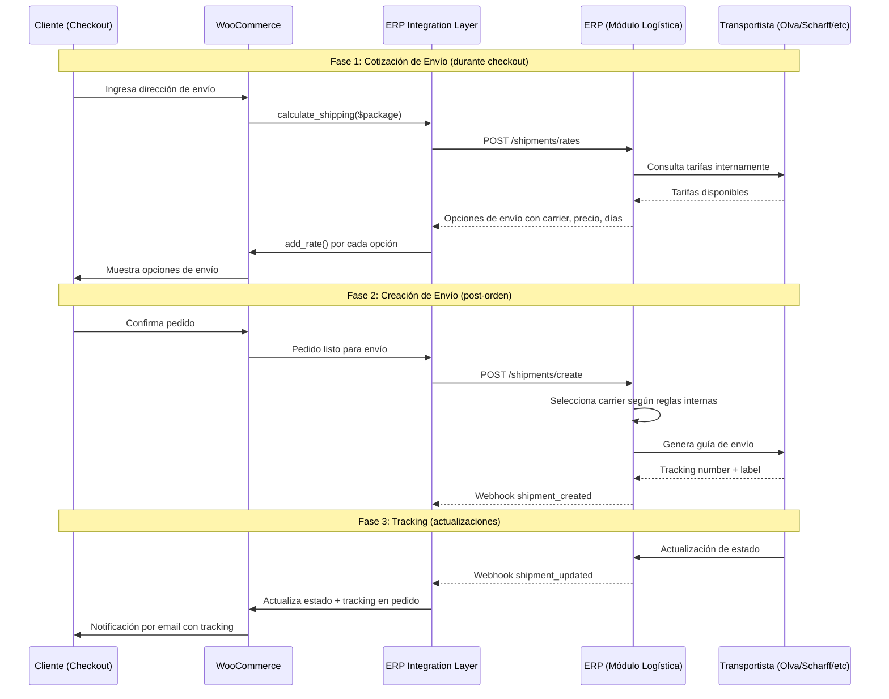
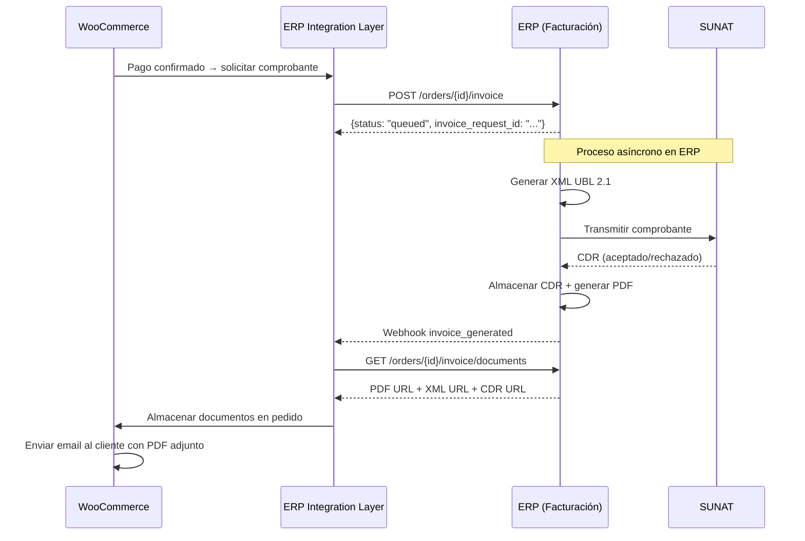
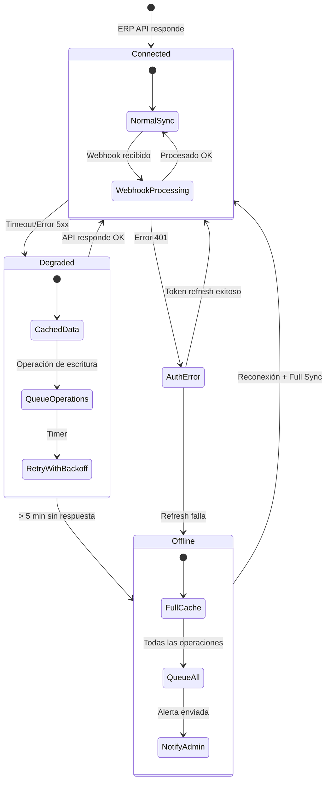
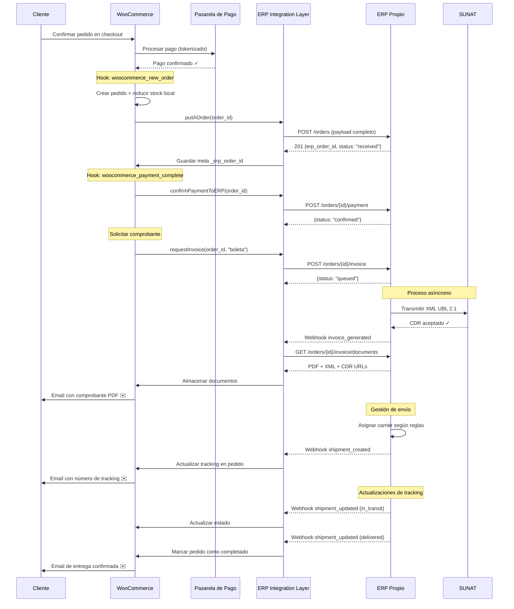
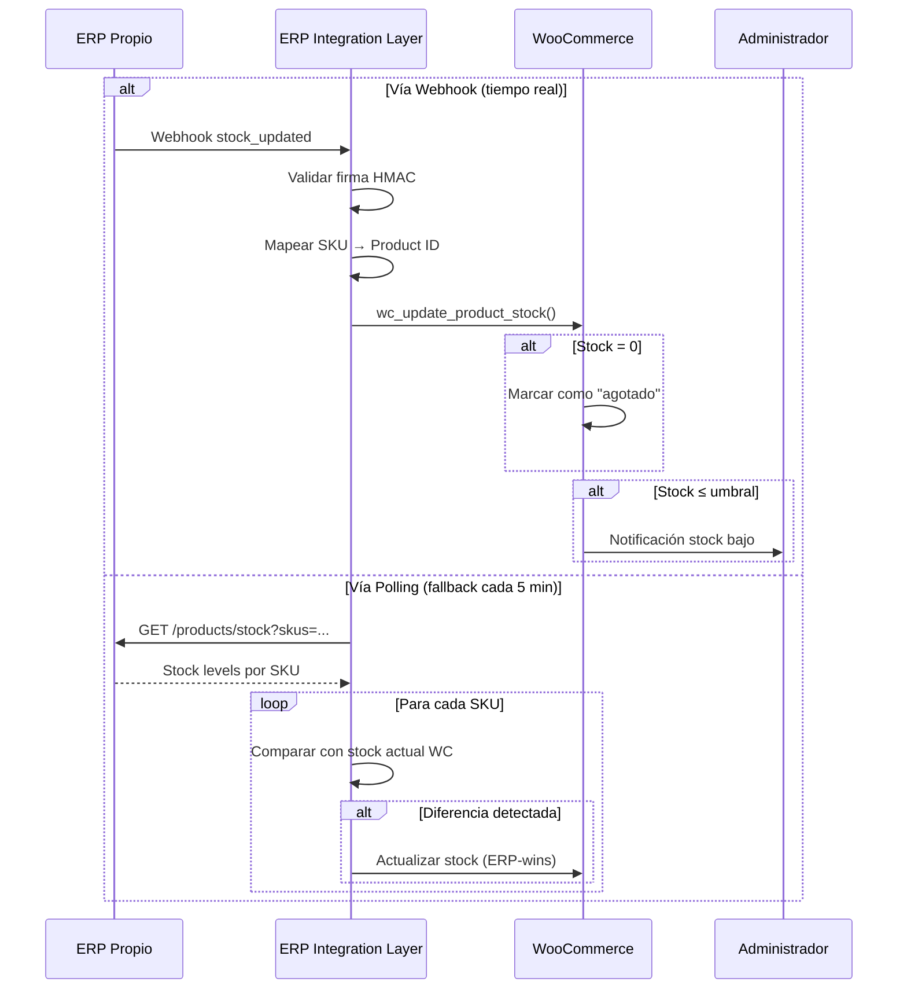
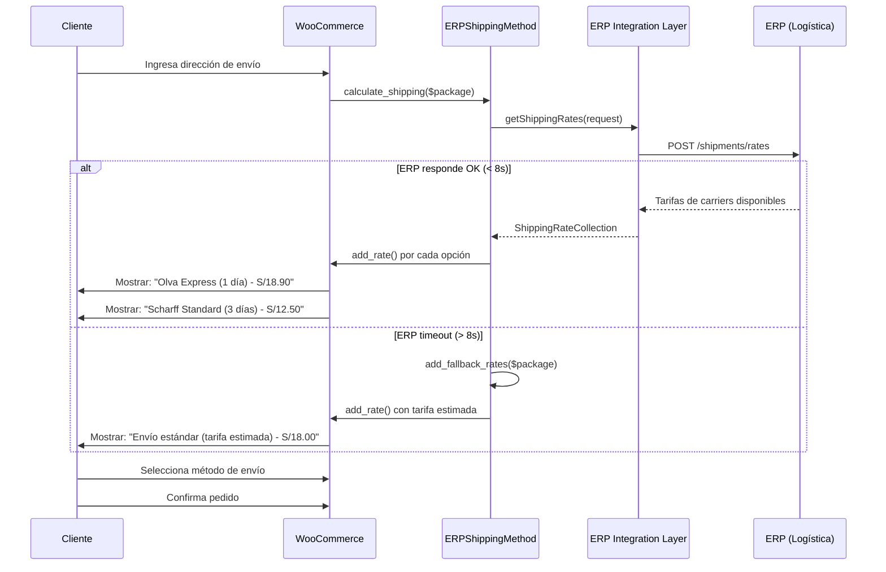
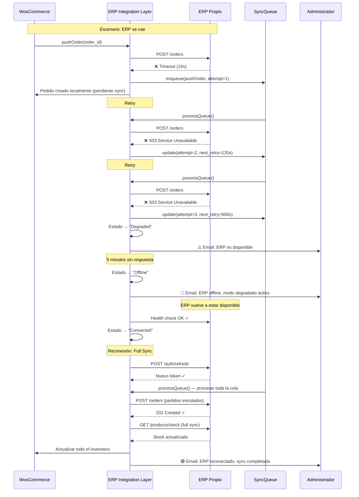
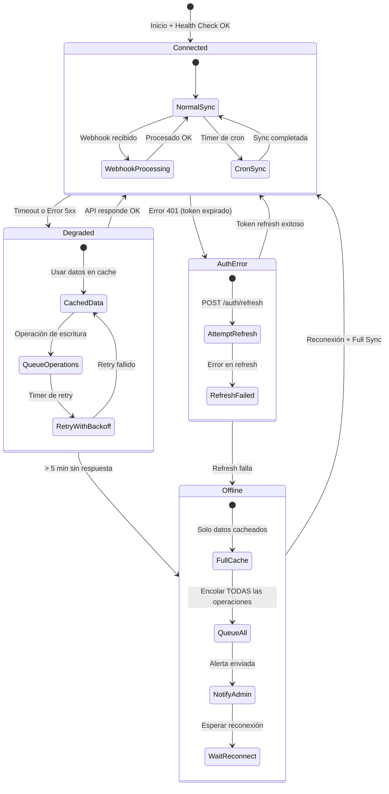

# Documentación de Integraciones: WooCommerce ↔ ERP

## 1. Resumen de Integraciones

### Matriz de Puntos de Integración

| # | Integración | Dirección | Método de Sync | Frecuencia/Trigger | Prioridad |
|---|-------------|-----------|----------------|-------------------|-----------|
| 1 | Productos y Catálogo | ERP → WC | Polling (delta sync por `updated_at`) | Cada 1 hora (3600s) | Alta |
| 2 | Inventario/Stock | ERP → WC | Webhook + Polling fallback | Webhook inmediato / Polling cada 5 min (300s) | Crítica |
| 3 | Precios | ERP → WC | Webhook + Polling fallback | Webhook inmediato / Polling cada 30 min (1800s) | Alta |
| 4 | Pedidos | WC → ERP | Event-driven (WC hooks) | Inmediato al crear orden | Crítica |
| 5 | Estado de Pedidos | ERP → WC | Webhook del ERP | Inmediato al cambiar estado | Alta |
| 6 | Clientes | WC → ERP | Event-driven (WC hooks) | Inmediato al crear/actualizar | Media |
| 7 | Logística/Envíos | Bidireccional | WC → ERP (request) / ERP → WC (webhooks) | Checkout + post-orden | Alta |
| 8 | Facturación Electrónica | WC → ERP → SUNAT | Event-driven + Webhook para resultado | Post-pago confirmado | Crítica |

### Principios Fundamentales

- **ERP es la fuente de verdad** para inventario, precios, catálogo y estado de pedidos
- **WooCommerce es un canal de ventas** que empuja órdenes al ERP y consume datos del ERP
- **Comunicación bidireccional asíncrona** con reconciliación periódica
- **Conflictos se resuelven con ERP-wins** (el ERP siempre tiene prioridad)
- **Consistencia eventual** garantizada mediante colas de retry y reconciliación

---

## 2. Integración de Productos y Catálogo (ERP → WooCommerce)

### Descripción General

El ERP es la fuente maestra del catálogo de productos. WooCommerce consume el catálogo completo o incremental (delta) desde el ERP y crea/actualiza productos localmente.

### Trigger y Frecuencia

- **Método**: Polling con delta sync por campo `updated_at`
- **Intervalo**: Cada 3600 segundos (1 hora)
- **Cron Job WP**: `erp_sync_products_cron`
- **Sync completa**: Disponible manualmente o tras reconexión post-offline

### Endpoint del ERP Consumido

```
GET /api/v1/products
```

**Query Parameters:**
| Parámetro | Tipo | Descripción |
|-----------|------|-------------|
| `since` | ISO 8601 datetime | Delta sync: solo productos actualizados desde esta fecha |
| `page` | integer | Número de página |
| `per_page` | integer | Productos por página (máx. 100) |
| `category` | string | Filtro opcional por categoría |

**Timeout**: 10000ms  
**Rate Limit**: 60 requests/min

### Esquema de Respuesta del ERP

```json
{
  "data": [
    {
      "sku": "string (identificador único)",
      "name": "string",
      "description": "string",
      "category_path": ["Zapatillas", "Running"],
      "attributes": {
        "sizes": ["36", "37", "38", "39", "40", "41", "42"],
        "colors": ["Negro", "Blanco", "Azul"]
      },
      "variations": [
        {
          "sku_variation": "ZAP-RUN-38-NEG",
          "size": "38",
          "color": "Negro",
          "price": 299.90,
          "sale_price": 249.90,
          "stock_quantity": 15,
          "images": ["https://erp.cliente.com/images/zap-negro.webp"]
        }
      ],
      "status": "active | inactive | discontinued",
      "updated_at": "2024-03-20T15:30:00-05:00"
    }
  ],
  "pagination": {
    "total": 250,
    "page": 1,
    "per_page": 50,
    "total_pages": 5
  }
}
```

### Lógica de Creación vs Actualización

```
Para cada producto recibido del ERP:
1. Buscar producto en WC por SKU (meta _sku)
2. SI existe → Actualizar datos (nombre, descripción, categorías, variaciones, imágenes)
3. SI NO existe → Crear nuevo producto en WC con todos los datos
4. Registrar operación en sync_log (create/update + status)
```

### Mapeo de Datos ERP → WooCommerce

| Campo ERP | Campo WooCommerce | Notas |
|-----------|-------------------|-------|
| `sku` | `_sku` (meta) | Identificador único de mapeo |
| `name` | `post_title` | Nombre del producto |
| `description` | `post_content` | Descripción larga |
| `category_path` | Taxonomía `product_cat` | Jerarquía de categorías |
| `attributes.sizes` | Atributo global "Talla" | `pa_talla` |
| `attributes.colors` | Atributo global "Color" | `pa_color` |
| `variations[].sku_variation` | Variación `_sku` | SKU por variación |
| `variations[].size` | Atributo de variación "Talla" | |
| `variations[].color` | Atributo de variación "Color" | |
| `variations[].price` | `_regular_price` | Precio regular |
| `variations[].sale_price` | `_sale_price` | Precio de oferta (null = sin oferta) |
| `variations[].stock_quantity` | `_stock` | Stock por variación |
| `variations[].images` | Imagen de variación | Asociada al color |
| `status` | `post_status` | Ver mapeo de estados abajo |

### Mapeo de Estados de Producto

| Estado ERP | Estado WooCommerce | Comportamiento |
|------------|-------------------|----------------|
| `active` | `publish` | Visible en tienda |
| `inactive` | `draft` | Oculto, editable en admin |
| `discontinued` | `private` | Oculto permanentemente, no se reactiva |

### Productos Variables (Talla × Color)

El ERP envía productos con variaciones definidas por combinación de talla y color. La transformación a WooCommerce:

1. **Producto padre**: Tipo `variable`, con atributos "Talla" y "Color" marcados como `variation: true`
2. **Variaciones**: Una por cada combinación talla×color con stock > 0 o historial
3. **Imágenes por color**: Cada variación con un color específico comparte la misma imagen

### Jerarquía de Categorías

El campo `category_path` del ERP es un array jerárquico:
```json
["Zapatillas", "Running"]
```

Se mapea a la taxonomía `product_cat` de WooCommerce:
- Si la categoría padre no existe → crearla
- Si la subcategoría no existe → crearla con `parent` = ID de la categoría padre
- Asignar el producto a la categoría más específica (hoja)

### Sincronización de Imágenes

1. Comparar URLs de imágenes del ERP con las actuales en WC
2. Si hay nuevas imágenes → descargar y adjuntar al producto
3. Si se eliminaron imágenes → remover del producto en WC
4. Mantener el orden (`position`) de las imágenes
5. La primera imagen es la imagen destacada del producto

### Error Handling Específico

| Error | Comportamiento |
|-------|---------------|
| Timeout > 10s | Usar datos cacheados, reintentar en próximo ciclo |
| SKU duplicado en WC | Log warning, actualizar el existente |
| Categoría inválida | Crear categoría automáticamente |
| Imagen no descargable | Log warning, continuar sin imagen |
| Rate limit (429) | Backoff exponencial, continuar en próximo ciclo |

### Fallback

- Si el ERP no responde, los productos existentes en WC permanecen sin cambios
- Se usa la última versión cacheada del catálogo
- Las operaciones pendientes se encolan para el próximo ciclo

---

## 3. Integración de Inventario/Stock (ERP → WooCommerce)

### Descripción General

El stock es gestionado centralmente por el ERP. WooCommerce recibe actualizaciones de stock vía webhooks en tiempo real, con polling como mecanismo de respaldo.

### Trigger y Frecuencia

- **Método primario**: Webhook `stock_updated` del ERP (inmediato)
- **Método fallback**: Polling cada 300 segundos (5 minutos)
- **Cron Job WP**: `erp_sync_stock_cron`
- **Hook WC**: N/A (el stock se actualiza desde el ERP, no desde WC)

### Webhook Recibido: `stock_updated`

**Endpoint WC**: `POST /wp-json/erp-integration/v1/webhook`

**Payload del webhook:**
```json
{
  "event": "stock_updated",
  "data": [
    {
      "sku": "ZAP-RUN-38-NEG",
      "new_quantity": 10,
      "previous_quantity": 15,
      "reason": "sale | return | adjustment | restock"
    }
  ],
  "timestamp": "2024-03-20T15:30:00-05:00"
}
```

### Endpoint del ERP para Polling

```
GET /api/v1/products/stock
```

**Query Parameters:**
| Parámetro | Tipo | Descripción |
|-----------|------|-------------|
| `skus` | string[] (comma-separated) | SKUs a consultar (máx. 100) |

**Timeout**: 5000ms  
**Rate Limit**: 120 requests/min

**Respuesta:**
```json
{
  "data": [
    {
      "sku": "ZAP-RUN-38-NEG",
      "stock_quantity": 10,
      "reserved": 2,
      "available": 8,
      "warehouse": "LIMA-01",
      "updated_at": "2024-03-20T15:30:00-05:00"
    }
  ]
}
```

### Mapeo de SKU entre Sistemas

```
ERP SKU (sku_variation) ←→ WooCommerce Variation SKU (_sku meta)
```

El mapeo se realiza por el campo `_sku` de cada variación de producto en WooCommerce. El proceso:
1. Recibir SKU del ERP
2. Buscar variación en WC con `meta_key = '_sku'` y `meta_value = {sku_erp}`
3. Si se encuentra → actualizar `_stock`
4. Si NO se encuentra → log warning, encolar para revisión manual

### Niveles de Stock

| Campo ERP | Uso |
|-----------|-----|
| `stock_quantity` | Total físico en almacén |
| `reserved` | Unidades reservadas (pedidos en proceso) |
| `available` | Unidades disponibles para venta (`stock_quantity - reserved`) |

**En WooCommerce se usa `available`** como valor de `_stock` para reflejar el stock real disponible para compra.

### Comportamiento Automático

| Condición | Acción en WooCommerce |
|-----------|----------------------|
| `available = 0` | Marcar producto/variación como "agotado" (`_stock_status = 'outofstock'`) |
| `available > 0` y estaba agotado | Reactivar producto (`_stock_status = 'instock'`) |
| `available ≤ umbral_bajo` (default: 5) | Enviar notificación de stock bajo al admin |
| Stock nuevo > umbral y producto oculto | Reactivar visibilidad si estaba oculto por agotamiento |

### Resolución de Conflictos (ERP-Wins)

```php
// La resolución es determinista: ERP siempre gana
public function resolveStockConflict(int $wcStock, int $erpStock, string $sku): int {
    // resolve(wcStock, erpStock) ≡ erpStock para TODOS los inputs
    $this->logger->info("Stock conflict resolved", [
        'sku' => $sku,
        'wc_stock' => $wcStock,
        'erp_stock' => $erpStock,
        'resolved_to' => $erpStock
    ]);
    return $erpStock;
}
```

### Error Handling Específico

| Error | Comportamiento |
|-------|---------------|
| Timeout > 5s (polling) | Usar último valor cacheado, marcar como "pendiente de sync" |
| SKU no encontrado en WC | Log warning, crear producto si `auto_create` habilitado |
| Webhook con firma inválida | Rechazar (HTTP 401), log de seguridad |
| Webhook con payload malformado | Rechazar (HTTP 400), log con payload recibido |
| Rate limit (429) | Backoff exponencial, procesar en siguiente ciclo |

### Fallback

- Si el ERP no responde al polling, se mantiene el último stock conocido
- Los webhooks tienen prioridad sobre el polling
- Si hay discrepancia entre webhook y polling, se usa el dato más reciente (`updated_at`)

---

## 4. Integración de Precios (ERP → WooCommerce)

### Descripción General

Los precios son gestionados por el ERP, que soporta listas de precios diferenciadas. WooCommerce consume la lista de precios "web" y actualiza precios regulares y de oferta.

### Trigger y Frecuencia

- **Método primario**: Webhook `price_updated` del ERP (inmediato)
- **Método fallback**: Polling cada 1800 segundos (30 minutos)
- **Cron Job WP**: `erp_sync_prices_cron`

### Webhook Recibido: `price_updated`

**Payload del webhook:**
```json
{
  "event": "price_updated",
  "data": [
    {
      "sku": "ZAP-RUN-38-NEG",
      "new_price": 319.90,
      "new_sale_price": 269.90
    }
  ],
  "timestamp": "2024-03-20T15:30:00-05:00"
}
```

### Endpoint del ERP para Polling

```
GET /api/v1/products/prices
```

**Query Parameters:**
| Parámetro | Tipo | Descripción |
|-----------|------|-------------|
| `skus` | string[] (comma-separated) | SKUs a consultar (máx. 100) |
| `price_list` | string | Lista de precios (default: `'web'`) |

**Timeout**: 5000ms  
**Rate Limit**: 120 requests/min

**Respuesta:**
```json
{
  "data": [
    {
      "sku": "ZAP-RUN-38-NEG",
      "regular_price": 319.90,
      "sale_price": 269.90,
      "sale_start": "2024-03-01T00:00:00-05:00",
      "sale_end": "2024-03-31T23:59:59-05:00",
      "currency": "PEN",
      "tax_included": true
    }
  ]
}
```

### Mapeo de Datos

| Campo ERP | Campo WooCommerce | Notas |
|-----------|-------------------|-------|
| `regular_price` | `_regular_price` | Precio sin descuento |
| `sale_price` | `_sale_price` | Precio con descuento (null = sin oferta) |
| `sale_start` | `_sale_price_dates_from` | Inicio de oferta programada |
| `sale_end` | `_sale_price_dates_to` | Fin de oferta programada |
| `currency` | Configuración global WC | Siempre PEN (Sol peruano) |
| `tax_included` | `_price_includes_tax` | Si el precio ya incluye IGV |

### Listas de Precios

El ERP soporta múltiples listas de precios. Para WooCommerce se usa la lista `'web'`:
- **web**: Precios específicos para el canal online
- Si no existe precio en lista `'web'`, se usa el precio general del ERP

### Manejo de Moneda

- Moneda fija: **PEN** (Sol peruano)
- WooCommerce configurado con `woocommerce_currency = 'PEN'`
- Formato: S/ XXX.XX (2 decimales)
- IGV (18%) incluido en precio según flag `tax_included`

### Rangos de Fechas de Oferta

Cuando el ERP envía `sale_start` y `sale_end`:
1. Se programan las fechas en WooCommerce
2. WooCommerce activa/desactiva automáticamente el precio de oferta según las fechas
3. Si `sale_end` es pasado → se ignora el `sale_price`
4. Si `sale_start` es futuro → se programa para activación automática

### Error Handling Específico

| Error | Comportamiento |
|-------|---------------|
| Timeout > 5s | Mantener precios actuales, reintentar en próximo ciclo |
| Precio = 0 o negativo | Log error, NO actualizar (protección contra datos corruptos) |
| SKU no encontrado | Log warning, ignorar |
| Rate limit (429) | Backoff exponencial |

### Fallback

- Si el ERP no responde, los precios actuales en WC se mantienen sin cambios
- No se muestran precios "estimados" — se usa el último precio confirmado

---

## 5. Integración de Pedidos (WooCommerce → ERP)

### Descripción General

Cuando se crea un pedido en WooCommerce, se empuja inmediatamente al ERP. El ERP es responsable de procesar el pedido, gestionar el envío y generar la facturación.

### Trigger

- **Hook WooCommerce**: `woocommerce_new_order`
- **Método**: Event-driven (inmediato)
- **Dirección**: WC → ERP

### Hook de WooCommerce

```php
add_action('woocommerce_new_order', [$syncService, 'pushOrder']);
```

### Endpoint del ERP

```
POST /api/v1/orders
```

**Timeout**: 10000ms  
**Rate Limit**: 30 requests/min

### Payload Enviado al ERP (Request)

```json
{
  "external_id": "WC-1234",
  "channel": "woocommerce",
  "customer": {
    "external_id": "WC-CUST-567",
    "name": "Juan Pérez García",
    "email": "juan.perez@email.com",
    "phone": "+51987654321",
    "document_type": "DNI",
    "document_number": "12345678"
  },
  "shipping_address": {
    "address_1": "Av. Javier Prado Este 1234",
    "address_2": "Dpto 501",
    "city": "San Isidro",
    "state": "Lima",
    "postcode": "15036",
    "country": "PE"
  },
  "items": [
    {
      "sku": "ZAP-RUN-38-NEG",
      "quantity": 2,
      "unit_price": 249.90,
      "subtotal": 499.80
    }
  ],
  "totals": {
    "subtotal": 499.80,
    "tax": 89.96,
    "shipping": 15.00,
    "total": 604.76
  },
  "payment": {
    "method": "mercadopago",
    "transaction_id": "MP-TXN-789012",
    "status": "paid"
  },
  "notes": "Entregar en horario de oficina"
}
```

### Respuesta del ERP

```json
{
  "erp_order_id": "ERP-ORD-2024-0456",
  "status": "received",
  "created_at": "2024-03-20T15:30:00-05:00",
  "errors": null
}
```

### Mapeo de Datos WC → ERP

| Campo WooCommerce | Campo ERP | Transformación |
|-------------------|-----------|----------------|
| `$order->get_id()` | `external_id` | Prefijo "WC-" + ID |
| Canal fijo | `channel` | Siempre `"woocommerce"` |
| `$order->get_customer_id()` | `customer.external_id` | Prefijo "WC-CUST-" + ID |
| `billing_first_name` + `billing_last_name` | `customer.name` | Concatenación |
| `billing_email` | `customer.email` | Directo |
| `billing_phone` | `customer.phone` | Formato +51... |
| Meta `_document_type` | `customer.document_type` | DNI/RUC/CE |
| Meta `_document_number` | `customer.document_number` | Directo |
| `shipping_address_1` | `shipping_address.address_1` | Directo |
| `shipping_city` | `shipping_address.city` | Distrito |
| `shipping_state` | `shipping_address.state` | Departamento |
| Items del pedido | `items[]` | SKU + cantidad + precio |
| `$order->get_total()` | `totals.total` | Directo |
| Método de pago | `payment.method` | Slug del gateway |
| Transaction ID | `payment.transaction_id` | Del gateway |

### Sincronización de Estado de Pedido (Bidireccional)

**WC → ERP** (hook `woocommerce_order_status_changed`):
```php
add_action('woocommerce_order_status_changed', [$syncService, 'syncOrderStatus']);
```

**ERP → WC** (webhook `order_status_changed`):
```json
{
  "event": "order_status_changed",
  "data": {
    "erp_order_id": "ERP-ORD-2024-0456",
    "external_id": "WC-1234",
    "old_status": "processing",
    "new_status": "shipped",
    "shipment": {
      "carrier": "Olva Courier",
      "tracking_number": "OLV-123456789"
    }
  },
  "timestamp": "2024-03-21T10:00:00-05:00"
}
```

### Mapeo de Estados

| Estado ERP | Estado WooCommerce |
|------------|-------------------|
| `received` | `processing` |
| `processing` | `processing` |
| `shipped` | `shipped` (custom status) |
| `delivered` | `completed` |
| `cancelled` | `cancelled` |

### Confirmación de Pago

**Hook WC**: `woocommerce_payment_complete`

```php
add_action('woocommerce_payment_complete', [$syncService, 'confirmPaymentToERP']);
```

**Endpoint ERP:**
```
POST /api/v1/orders/{erp_order_id}/payment
```

**Request:**
```json
{
  "transaction_id": "MP-TXN-789012",
  "amount": 604.76,
  "currency": "PEN",
  "method": "mercadopago",
  "confirmed_at": "2024-03-20T15:35:00-05:00"
}
```

**Response:**
```json
{
  "status": "confirmed",
  "invoice_number": null
}
```

### Manejo de Orden Duplicada (409 Conflict)

Si el ERP responde con HTTP 409:
1. Verificar si la orden ya existe en el ERP (por `external_id`)
2. Si coincide → vincular el `erp_order_id` al pedido WC
3. Log warning de duplicado
4. NO crear una segunda orden

### Error Handling Específico

| Error | Comportamiento |
|-------|---------------|
| Timeout > 10s | Encolar operación, reintentar con backoff |
| 409 Conflict | Verificar duplicado, vincular si existe |
| 422 Validation | Log detallado, notificar admin, NO reintentar |
| 500/503 ERP caído | Encolar, activar modo degradado |
| Datos incompletos en WC | Log error, notificar admin |

### Fallback

- Si el ERP no está disponible, el pedido se crea en WC normalmente
- La operación de push se encola para retry
- El admin recibe notificación de pedidos pendientes de sync
- Al reconectar, se procesan todos los pedidos encolados en orden FIFO

---

## 6. Integración de Clientes (WooCommerce → ERP)

### Descripción General

Los datos de clientes se sincronizan desde WooCommerce al ERP cuando se crean o actualizan. El ERP puede fusionar clientes existentes basándose en documento de identidad o email.

### Trigger

- **Hooks WooCommerce**: `woocommerce_created_customer`, `woocommerce_update_customer`
- **Método**: Event-driven (inmediato)
- **Dirección**: WC → ERP

### Hooks de WooCommerce

```php
add_action('woocommerce_created_customer', [$syncService, 'pushCustomer']);
add_action('woocommerce_update_customer', [$syncService, 'pushCustomer']);
```

### Endpoint del ERP

```
POST /api/v1/customers
```

**Timeout**: 5000ms

### Payload Enviado al ERP

```json
{
  "external_id": "WC-CUST-567",
  "name": "Juan Pérez García",
  "email": "juan.perez@email.com",
  "phone": "+51987654321",
  "document_type": "DNI",
  "document_number": "12345678",
  "addresses": [
    {
      "type": "billing",
      "address_1": "Av. Javier Prado Este 1234",
      "address_2": "Dpto 501",
      "city": "San Isidro",
      "state": "Lima",
      "postcode": "15036",
      "country": "PE"
    },
    {
      "type": "shipping",
      "address_1": "Av. Javier Prado Este 1234",
      "address_2": "Dpto 501",
      "city": "San Isidro",
      "state": "Lima",
      "postcode": "15036",
      "country": "PE"
    }
  ]
}
```

### Respuesta del ERP

```json
{
  "erp_customer_id": "ERP-CLI-890",
  "status": "created | updated | merged"
}
```

### Mapeo de Datos

| Campo WooCommerce | Campo ERP | Notas |
|-------------------|-----------|-------|
| `customer_id` | `external_id` | Prefijo "WC-CUST-" + ID |
| `first_name` + `last_name` | `name` | Concatenación |
| `email` | `email` | Directo |
| `billing_phone` | `phone` | Formato internacional |
| Meta `_document_type` | `document_type` | DNI / RUC / CE |
| Meta `_document_number` | `document_number` | Número de documento |
| Direcciones billing/shipping | `addresses[]` | Array con tipo |

### Estrategia de Merge

El ERP puede responder con `status: "merged"` cuando detecta un cliente existente:

**Criterios de merge del ERP:**
1. Mismo `document_number` + `document_type` → merge
2. Mismo `email` → merge
3. Ninguna coincidencia → crear nuevo

**Comportamiento post-merge:**
- WooCommerce almacena el `erp_customer_id` retornado como meta del customer
- Futuros pedidos de este cliente se vinculan al mismo `erp_customer_id`

### Resolución de Conflictos para Datos de Cliente

```php
// Estrategia: Merge (WC puede tener datos más recientes de contacto)
public function resolveCustomerConflict(array $wcData, array $erpData): array {
    return [
        'name' => $erpData['name'] ?? $wcData['name'],           // ERP wins en nombre
        'email' => $wcData['email'],                              // WC wins en email (más reciente)
        'phone' => $wcData['phone'] ?? $erpData['phone'],        // WC wins si tiene dato
        'document_type' => $erpData['document_type'],            // ERP wins en documento
        'document_number' => $erpData['document_number'],        // ERP wins en documento
        'addresses' => array_merge($erpData['addresses'], $wcData['addresses']), // Merge
    ];
}
```

### Error Handling Específico

| Error | Comportamiento |
|-------|---------------|
| Timeout > 5s | Encolar, reintentar con backoff |
| Email duplicado (422) | Log, vincular con cliente existente |
| Datos incompletos | Enviar lo disponible, log warning |
| ERP no disponible | Encolar operación |

---

## 7. Integración de Logística/Envíos (Bidireccional vía ERP)

### Descripción General

WooCommerce NO se conecta directamente con proveedores logísticos. Toda la coordinación con carriers (Olva, Scharff, PedidosYa, Rappi) es responsabilidad del módulo de logística del ERP. WooCommerce consulta tarifas al ERP y recibe actualizaciones de tracking vía webhooks.

### Flujo Completo



### 7.1 Consulta de Tarifas (WC → ERP durante Checkout)

**Clase WooCommerce**: `ERPShippingMethod extends WC_Shipping_Method`

**Endpoint ERP:**
```
POST /api/v1/shipments/rates
```

**Timeout**: 8000ms  
**Rate Limit**: 60 requests/min

**Request:**
```json
{
  "origin": "LIMA-01",
  "destination": {
    "department": "Lima",
    "province": "Lima",
    "district": "San Isidro"
  },
  "weight_kg": 1.5,
  "dimensions": {
    "length_cm": 35,
    "width_cm": 25,
    "height_cm": 15
  }
}
```

**Response:**
```json
{
  "rates": [
    {
      "carrier": "Olva Courier",
      "service": "express",
      "price": 18.90,
      "currency": "PEN",
      "estimated_days": 1,
      "available": true,
      "carrier_logo_url": "https://erp.cliente.com/logos/olva.png"
    },
    {
      "carrier": "Scharff",
      "service": "standard",
      "price": 12.50,
      "currency": "PEN",
      "estimated_days": 3,
      "available": true,
      "carrier_logo_url": "https://erp.cliente.com/logos/scharff.png"
    },
    {
      "carrier": "PedidosYa",
      "service": "same_day",
      "price": 25.00,
      "currency": "PEN",
      "estimated_days": 0,
      "available": true,
      "carrier_logo_url": null
    }
  ]
}
```

**Transformación a WC Shipping Rates:**
```php
foreach ($rates as $rate) {
    $this->add_rate([
        'id'    => 'erp_' . sanitize_title($rate->carrier . '_' . $rate->service),
        'label' => sprintf('%s - %s (%d días)', $rate->carrier, $rate->service, $rate->estimated_days),
        'cost'  => $rate->price,
        'meta_data' => [
            'erp_carrier' => $rate->carrier,
            'erp_service' => $rate->service,
            'estimated_days' => $rate->estimated_days,
        ],
    ]);
}
```

### 7.2 Creación de Envío (WC → ERP post-orden)

**Endpoint ERP:**
```
POST /api/v1/shipments/create
```

**Timeout**: 15000ms  
**Rate Limit**: 30 requests/min

**Request:**
```json
{
  "erp_order_id": "ERP-ORD-2024-0456",
  "preferred_carrier": "Olva Courier",
  "preferred_service": "express",
  "shipping_address": {
    "recipient_name": "Juan Pérez García",
    "phone": "+51987654321",
    "address_1": "Av. Javier Prado Este 1234",
    "address_2": "Dpto 501",
    "district": "San Isidro",
    "province": "Lima",
    "department": "Lima",
    "postcode": "15036",
    "country": "PE",
    "reference": "Frente al parque"
  },
  "package": {
    "weight_kg": 1.5,
    "length_cm": 35,
    "width_cm": 25,
    "height_cm": 15,
    "declared_value": 604.76
  },
  "notes": "Entregar en horario de oficina"
}
```

**Response:**
```json
{
  "shipment_id": "ERP-SHP-2024-0789",
  "status": "created",
  "carrier": "Olva Courier",
  "tracking_number": "OLV-123456789",
  "label_url": "https://erp.cliente.com/labels/OLV-123456789.pdf",
  "estimated_delivery": "2024-03-22T18:00:00-05:00",
  "created_at": "2024-03-21T10:00:00-05:00"
}
```

### 7.3 Actualizaciones de Tracking (ERP → WC vía Webhooks)

**Webhook `shipment_created`:**
```json
{
  "event": "shipment_created",
  "data": {
    "erp_order_id": "ERP-ORD-2024-0456",
    "external_id": "WC-1234",
    "shipment_id": "ERP-SHP-2024-0789",
    "carrier": "Olva Courier",
    "service": "express",
    "tracking_number": "OLV-123456789",
    "tracking_url": "https://tracking.olva.com.pe/OLV-123456789",
    "label_url": "https://erp.cliente.com/labels/OLV-123456789.pdf",
    "estimated_delivery": "2024-03-22T18:00:00-05:00"
  },
  "timestamp": "2024-03-21T10:05:00-05:00"
}
```

**Webhook `shipment_updated`:**
```json
{
  "event": "shipment_updated",
  "data": {
    "erp_order_id": "ERP-ORD-2024-0456",
    "external_id": "WC-1234",
    "shipment_id": "ERP-SHP-2024-0789",
    "carrier": "Olva Courier",
    "tracking_number": "OLV-123456789",
    "status": "in_transit",
    "event_description": "Paquete en tránsito hacia destino",
    "event_location": "Centro de distribución Lima Norte"
  },
  "timestamp": "2024-03-21T14:30:00-05:00"
}
```

### 7.4 Consulta de Tracking (Polling alternativo)

**Endpoint ERP:**
```
GET /api/v1/shipments/{erp_order_id}/tracking
```

**Timeout**: 8000ms  
**Rate Limit**: 60 requests/min

**Response:**
```json
{
  "erp_order_id": "ERP-ORD-2024-0456",
  "shipment_id": "ERP-SHP-2024-0789",
  "carrier": "Olva Courier",
  "tracking_number": "OLV-123456789",
  "tracking_url": "https://tracking.olva.com.pe/OLV-123456789",
  "status": "in_transit",
  "estimated_delivery": "2024-03-22T18:00:00-05:00",
  "events": [
    {
      "status": "picked_up",
      "timestamp": "2024-03-21T10:30:00-05:00",
      "description": "Paquete recogido en almacén",
      "location": "Almacén LIMA-01"
    },
    {
      "status": "in_transit",
      "timestamp": "2024-03-21T14:30:00-05:00",
      "description": "En tránsito hacia destino",
      "location": "Centro de distribución Lima Norte"
    }
  ],
  "updated_at": "2024-03-21T14:30:00-05:00"
}
```

### Carriers Soportados (Asignados por ERP)

| Carrier | Servicios | Cobertura |
|---------|-----------|-----------|
| Olva Courier | express, standard | Nacional |
| Scharff | standard, economy | Nacional |
| PedidosYa | same_day | Lima Metropolitana |
| Rappi | same_day, express | Lima Metropolitana |

### Tarifas de Respaldo (Fallback)

Cuando el ERP no responde (timeout > 8s), se usan tarifas locales por zona:

```php
private function add_fallback_rates(array $package): void {
    $zone = $this->determine_zone($package['destination']);
    $fallback_rates = get_option('erp_shipping_fallback_rates', [
        'lima_metropolitana' => 12.00,
        'lima_provincias'    => 18.00,
        'costa'              => 22.00,
        'sierra'             => 28.00,
        'selva'              => 35.00,
    ]);
    
    if (isset($fallback_rates[$zone])) {
        $this->add_rate([
            'id'    => 'erp_fallback_' . $zone,
            'label' => 'Envío estándar (tarifa estimada)',
            'cost'  => $fallback_rates[$zone],
            'meta_data' => ['is_fallback' => true],
        ]);
    }
}
```

### Error Handling Específico

| Error | Comportamiento |
|-------|---------------|
| Timeout > 8s (tarifas) | Usar tarifas fallback por zona, mostrar "tarifa estimada" |
| Timeout > 15s (crear envío) | Encolar, reintentar, notificar admin |
| ERP no puede asignar carrier | Notificar admin, pedido queda "pendiente de envío" |
| Peso/dimensiones exceden límites | Marcar "requiere cotización especial", notificar admin |
| Tracking no disponible aún | Mostrar "envío en preparación", reintentar en próximo polling |

---

## 8. Integración de Facturación Electrónica (WC → ERP → SUNAT)

### Descripción General

El ERP es responsable de generar comprobantes electrónicos (boletas/facturas), transmitirlos a SUNAT y devolver el CDR/PDF a WooCommerce vía API. WooCommerce solicita la generación del comprobante y recibe el resultado vía webhook.

### Flujo Completo



### 8.1 Solicitud de Comprobante (WC → ERP)

**Trigger**: Después de confirmación de pago (`woocommerce_payment_complete`)

**Endpoint ERP:**
```
POST /api/v1/orders/{erp_order_id}/invoice
```

**Timeout**: 10000ms  
**Rate Limit**: 30 requests/min

**Request:**
```json
{
  "invoice_type": "boleta",
  "customer_document_type": "DNI",
  "customer_document_number": "12345678",
  "customer_name": "Juan Pérez García",
  "customer_address": null
}
```

**Regla de tipo de comprobante:**
| Tipo Documento | Comprobante | Serie |
|----------------|-------------|-------|
| DNI | Boleta | B001-XXXXX |
| CE (Carné Extranjería) | Boleta | B001-XXXXX |
| RUC | Factura | F001-XXXXX |

**Nota**: Para factura (`invoice_type: "factura"`), el campo `customer_address` es obligatorio (dirección fiscal del RUC).

**Response:**
```json
{
  "status": "queued",
  "invoice_request_id": "INV-REQ-2024-0123",
  "estimated_completion_seconds": 30
}
```

### 8.2 Consulta de Estado de Facturación

**Endpoint ERP:**
```
GET /api/v1/orders/{erp_order_id}/invoice/status
```

**Timeout**: 5000ms  
**Rate Limit**: 60 requests/min

**Response:**
```json
{
  "erp_order_id": "ERP-ORD-2024-0456",
  "invoice_status": "accepted",
  "sunat_response_code": "0",
  "sunat_response_message": "La Factura numero F001-00001234, ha sido aceptada",
  "invoice_series": "B001",
  "invoice_number": "00005678",
  "generated_at": "2024-03-20T15:40:00-05:00",
  "transmitted_at": "2024-03-20T15:41:00-05:00"
}
```

**Estados posibles:**
| Estado | Descripción |
|--------|-------------|
| `pending` | Solicitud recibida, en cola |
| `generated` | XML generado, pendiente de envío a SUNAT |
| `accepted` | SUNAT aceptó el comprobante |
| `rejected` | SUNAT rechazó el comprobante |
| `error` | Error interno del ERP al generar |

### 8.3 Obtención de Documentos

**Endpoint ERP:**
```
GET /api/v1/orders/{erp_order_id}/invoice/documents
```

**Timeout**: 5000ms  
**Rate Limit**: 60 requests/min

**Response:**
```json
{
  "erp_order_id": "ERP-ORD-2024-0456",
  "pdf_url": "https://erp.cliente.com/invoices/B001-00005678.pdf?token=abc123&expires=3600",
  "xml_url": "https://erp.cliente.com/invoices/B001-00005678.xml?token=def456&expires=3600",
  "cdr_xml_url": "https://erp.cliente.com/invoices/B001-00005678-cdr.xml?token=ghi789&expires=3600",
  "invoice_series": "B001",
  "invoice_number": "00005678"
}
```

**Nota**: Las URLs son firmadas y expiran en 1 hora. El plugin debe descargar y almacenar los documentos localmente.

### 8.4 Webhook de Comprobante Generado

**Webhook `invoice_generated`:**
```json
{
  "event": "invoice_generated",
  "data": {
    "erp_order_id": "ERP-ORD-2024-0456",
    "external_id": "WC-1234",
    "invoice_type": "boleta",
    "invoice_series": "B001",
    "invoice_number": "00005678",
    "sunat_status": "accepted",
    "sunat_response_code": "0",
    "sunat_response_message": "Aceptada",
    "pdf_url": "https://erp.cliente.com/invoices/B001-00005678.pdf?token=abc123&expires=3600",
    "xml_url": "https://erp.cliente.com/invoices/B001-00005678.xml?token=def456&expires=3600",
    "cdr_xml_url": "https://erp.cliente.com/invoices/B001-00005678-cdr.xml?token=ghi789&expires=3600"
  },
  "timestamp": "2024-03-20T15:42:00-05:00"
}
```

### Almacenamiento en WooCommerce

Al recibir el webhook `invoice_generated`:
1. Descargar PDF, XML y CDR desde las URLs firmadas
2. Almacenar como adjuntos del pedido (WP Media Library, privados)
3. Guardar metadatos en el pedido:
   - `_erp_invoice_series`: Serie del comprobante
   - `_erp_invoice_number`: Número del comprobante
   - `_erp_invoice_type`: boleta/factura
   - `_erp_invoice_status`: accepted/rejected
   - `_erp_invoice_pdf_id`: Attachment ID del PDF
   - `_erp_invoice_xml_id`: Attachment ID del XML
   - `_erp_invoice_cdr_id`: Attachment ID del CDR
4. Enviar email al cliente con PDF adjunto

### Notificación al Cliente

- Email automático con:
  - Asunto: "Tu comprobante de pago - [Serie]-[Número]"
  - Cuerpo: Detalle del pedido + enlace de descarga del PDF
  - Adjunto: PDF del comprobante

### Error Handling Específico

| Error | Comportamiento |
|-------|---------------|
| ERP no responde a solicitud | Encolar, reintentar con backoff, notificar admin |
| ERP reporta rechazo de SUNAT | Log código de rechazo, notificar admin, marcar "facturación pendiente" |
| URLs de documentos expiradas | Solicitar nuevas URLs vía GET /invoice/documents |
| Descarga de PDF/XML falla | Reintentar 3 veces, notificar admin si persiste |
| Tipo de documento inválido | Log error, solicitar revisión manual |

---

## 9. Webhooks del ERP

### Descripción General

El ERP envía webhooks a WooCommerce para notificar cambios en tiempo real. Todos los webhooks se reciben en un único endpoint REST.

### Endpoint de Recepción

```
POST /wp-json/erp-integration/v1/webhook
```

**Registro del endpoint:**
```php
add_action('rest_api_init', function() {
    register_rest_route('erp-integration/v1', '/webhook', [
        'methods'  => 'POST',
        'callback' => [$webhookHandler, 'handle'],
        'permission_callback' => [$webhookHandler, 'validateSignature'],
    ]);
});
```

### Lista Completa de Webhooks

| Evento | Descripción | Frecuencia Esperada |
|--------|-------------|---------------------|
| `stock_updated` | Cambio de stock en uno o más SKUs | Alta (cada venta/ajuste) |
| `price_updated` | Cambio de precio en uno o más SKUs | Media (cambios de lista) |
| `order_status_changed` | Cambio de estado de un pedido | Media (por pedido) |
| `shipment_created` | Envío creado con carrier y tracking | Media (por pedido enviado) |
| `shipment_updated` | Actualización de estado de envío | Alta (múltiples por envío) |
| `invoice_generated` | Comprobante generado y transmitido a SUNAT | Media (por pedido pagado) |

### Validación de Firma (HMAC)

Todos los webhooks incluyen una firma HMAC-SHA256 en el header para validar autenticidad:

**Header**: `X-ERP-Signature`  
**Algoritmo**: HMAC-SHA256  
**Secret**: Configurado en `webhook_secret` del plugin

**Validación:**
```php
public function validateSignature(WP_REST_Request $request): bool {
    $payload = $request->get_body();
    $signature = $request->get_header('X-ERP-Signature');
    $secret = get_option('erp_webhook_secret');
    
    $expected = hash_hmac('sha256', $payload, $secret);
    
    return hash_equals($expected, $signature);
}
```

**Comportamiento ante firma inválida:**
- Responder HTTP 401 Unauthorized
- Log de seguridad con IP, timestamp y payload truncado
- NO procesar el webhook

### Esquemas de Payload por Webhook

#### `stock_updated`
```json
{
  "event": "stock_updated",
  "data": [
    {
      "sku": "ZAP-RUN-38-NEG",
      "new_quantity": 10,
      "previous_quantity": 15,
      "reason": "sale"
    },
    {
      "sku": "ZAP-RUN-39-BLA",
      "new_quantity": 0,
      "previous_quantity": 3,
      "reason": "sale"
    }
  ],
  "timestamp": "2024-03-20T15:30:00-05:00"
}
```

**Razones posibles**: `sale`, `return`, `adjustment`, `restock`

#### `price_updated`
```json
{
  "event": "price_updated",
  "data": [
    {
      "sku": "ZAP-RUN-38-NEG",
      "new_price": 319.90,
      "new_sale_price": 269.90
    }
  ],
  "timestamp": "2024-03-20T16:00:00-05:00"
}
```

#### `order_status_changed`
```json
{
  "event": "order_status_changed",
  "data": {
    "erp_order_id": "ERP-ORD-2024-0456",
    "external_id": "WC-1234",
    "old_status": "processing",
    "new_status": "shipped",
    "shipment": {
      "carrier": "Olva Courier",
      "tracking_number": "OLV-123456789"
    }
  },
  "timestamp": "2024-03-21T10:00:00-05:00"
}
```

#### `shipment_created`
```json
{
  "event": "shipment_created",
  "data": {
    "erp_order_id": "ERP-ORD-2024-0456",
    "external_id": "WC-1234",
    "shipment_id": "ERP-SHP-2024-0789",
    "carrier": "Olva Courier",
    "service": "express",
    "tracking_number": "OLV-123456789",
    "tracking_url": "https://tracking.olva.com.pe/OLV-123456789",
    "label_url": "https://erp.cliente.com/labels/OLV-123456789.pdf",
    "estimated_delivery": "2024-03-22T18:00:00-05:00"
  },
  "timestamp": "2024-03-21T10:05:00-05:00"
}
```

#### `shipment_updated`
```json
{
  "event": "shipment_updated",
  "data": {
    "erp_order_id": "ERP-ORD-2024-0456",
    "external_id": "WC-1234",
    "shipment_id": "ERP-SHP-2024-0789",
    "carrier": "Olva Courier",
    "tracking_number": "OLV-123456789",
    "status": "in_transit",
    "event_description": "Paquete en tránsito hacia destino",
    "event_location": "Centro de distribución Lima Norte"
  },
  "timestamp": "2024-03-21T14:30:00-05:00"
}
```

**Estados de envío posibles**: `picked_up`, `in_transit`, `out_for_delivery`, `delivered`, `returned`, `failed`

#### `invoice_generated`
```json
{
  "event": "invoice_generated",
  "data": {
    "erp_order_id": "ERP-ORD-2024-0456",
    "external_id": "WC-1234",
    "invoice_type": "boleta",
    "invoice_series": "B001",
    "invoice_number": "00005678",
    "sunat_status": "accepted",
    "sunat_response_code": "0",
    "sunat_response_message": "Aceptada",
    "pdf_url": "https://erp.cliente.com/invoices/B001-00005678.pdf?token=abc123&expires=3600",
    "xml_url": "https://erp.cliente.com/invoices/B001-00005678.xml?token=def456&expires=3600",
    "cdr_xml_url": "https://erp.cliente.com/invoices/B001-00005678-cdr.xml?token=ghi789&expires=3600"
  },
  "timestamp": "2024-03-20T15:42:00-05:00"
}
```

### Política de Reintentos del ERP

El ERP reintenta webhooks fallidos con la siguiente política:
- **Intento 1**: Inmediato
- **Intento 2**: 30 segundos después
- **Intento 3**: 2 minutos después
- **Intento 4**: 10 minutos después
- **Máximo**: 4 intentos

**Respuestas esperadas por el ERP:**
| HTTP Status | Significado para ERP |
|-------------|---------------------|
| 200 | Webhook procesado correctamente, no reintentar |
| 401 | Firma inválida, no reintentar (error de configuración) |
| 400 | Payload inválido, no reintentar |
| 500 | Error interno WC, reintentar según política |
| Timeout | Sin respuesta, reintentar según política |

### Configuración del Endpoint en ERP

El administrador debe configurar en el panel del ERP:
- **URL del webhook**: `https://mi-tienda.com/wp-json/erp-integration/v1/webhook`
- **Secret compartido**: Mismo valor que `webhook_secret` en WP
- **Eventos suscritos**: Seleccionar qué webhooks enviar
- **Timeout de espera**: 10 segundos (recomendado)

---

## 10. Endpoints del ERP Consumidos

### Autenticación

| Parámetro | Valor |
|-----------|-------|
| Tipo | API Key en Header |
| Header | `X-ERP-API-Key` |
| Credenciales | `ERP_API_KEY` + `ERP_API_SECRET` |
| Token Refresh | `POST /api/v1/auth/refresh` |
| Expiración del Token | 3600 segundos (1 hora) |

**Flujo de autenticación:**
1. Incluir `X-ERP-API-Key` en cada request
2. Si responde 401 → llamar a `/auth/refresh` con `ERP_API_SECRET`
3. Si refresh falla → notificar admin, pausar sync
4. Almacenar nuevo token con TTL

### Tabla Completa de Endpoints

| # | Método | Path | Propósito | Timeout | Rate Limit |
|---|--------|------|-----------|---------|------------|
| 1 | GET | `/products` | Listar/sincronizar catálogo | 10000ms | 60/min |
| 2 | GET | `/products/stock` | Consultar niveles de stock | 5000ms | 120/min |
| 3 | GET | `/products/prices` | Consultar precios | 5000ms | 120/min |
| 4 | POST | `/orders` | Crear pedido en ERP | 10000ms | 30/min |
| 5 | POST | `/orders/{id}/payment` | Confirmar pago | 5000ms | — |
| 6 | GET | `/orders/{id}/status` | Consultar estado de pedido | 5000ms | 60/min |
| 7 | POST | `/orders/{id}/invoice` | Solicitar comprobante | 10000ms | 30/min |
| 8 | GET | `/orders/{id}/invoice/status` | Estado de facturación | 5000ms | 60/min |
| 9 | GET | `/orders/{id}/invoice/documents` | Obtener PDF/XML/CDR | 5000ms | 60/min |
| 10 | POST | `/customers` | Sincronizar cliente | 5000ms | — |
| 11 | POST | `/shipments/rates` | Cotizar envío | 8000ms | 60/min |
| 12 | POST | `/shipments/create` | Crear envío | 15000ms | 30/min |
| 13 | GET | `/shipments/{id}/tracking` | Consultar tracking | 8000ms | 60/min |
| 14 | POST | `/auth/refresh` | Renovar token | 5000ms | 10/min |

### Detalle de Request/Response por Endpoint

#### 1. GET /products
- **Query**: `since`, `page`, `per_page`, `category`
- **Response**: Array de productos con variaciones, paginado
- **Uso**: Sync de catálogo (cron cada 1h)

#### 2. GET /products/stock
- **Query**: `skus` (comma-separated, max 100)
- **Response**: Array con `sku`, `stock_quantity`, `reserved`, `available`, `warehouse`
- **Uso**: Polling de stock (cron cada 5min)

#### 3. GET /products/prices
- **Query**: `skus` (comma-separated, max 100), `price_list`
- **Response**: Array con `sku`, `regular_price`, `sale_price`, `sale_start`, `sale_end`, `currency`, `tax_included`
- **Uso**: Polling de precios (cron cada 30min)

#### 4. POST /orders
- **Body**: Pedido completo (customer, items, totals, payment, shipping_address)
- **Response**: `erp_order_id`, `status`, `created_at`
- **Uso**: Push inmediato al crear orden

#### 5. POST /orders/{id}/payment
- **Body**: `transaction_id`, `amount`, `currency`, `method`, `confirmed_at`
- **Response**: `status` (confirmed/rejected), `invoice_number`
- **Uso**: Confirmar pago post-gateway

#### 6. GET /orders/{id}/status
- **Response**: Estado del pedido + datos de envío si aplica
- **Uso**: Verificación manual o polling de estado

#### 7. POST /orders/{id}/invoice
- **Body**: `invoice_type`, `customer_document_type`, `customer_document_number`, `customer_name`, `customer_address`
- **Response**: `status` (queued/processing/error), `invoice_request_id`
- **Uso**: Solicitar generación de comprobante

#### 8. GET /orders/{id}/invoice/status
- **Response**: Estado de facturación + datos SUNAT
- **Uso**: Verificar si comprobante fue aceptado

#### 9. GET /orders/{id}/invoice/documents
- **Response**: URLs firmadas de PDF, XML, CDR (expiran en 1h)
- **Uso**: Descargar documentos para almacenar en WC

#### 10. POST /customers
- **Body**: Datos del cliente (name, email, phone, document, addresses)
- **Response**: `erp_customer_id`, `status` (created/updated/merged)
- **Uso**: Sync de cliente al crear/actualizar

#### 11. POST /shipments/rates
- **Body**: `origin`, `destination`, `weight_kg`, `dimensions`
- **Response**: Array de tarifas con carrier, service, price, estimated_days
- **Uso**: Checkout — mostrar opciones de envío

#### 12. POST /shipments/create
- **Body**: `erp_order_id`, `preferred_carrier`, `shipping_address`, `package`
- **Response**: `shipment_id`, `carrier`, `tracking_number`, `label_url`
- **Uso**: Crear envío post-orden

#### 13. GET /shipments/{id}/tracking
- **Response**: Estado de tracking con eventos
- **Uso**: Polling de tracking (alternativa a webhooks)

#### 14. POST /auth/refresh
- **Body**: `api_secret`
- **Response**: Nuevo token con TTL
- **Uso**: Renovar token expirado

### Códigos de Error del ERP

| Código HTTP | Significado | Acción Recomendada |
|-------------|-------------|-------------------|
| 400 | Datos de request inválidos | Log error, corregir payload, NO reintentar |
| 401 | API key inválida o expirada | Intentar refresh; si falla, notificar admin |
| 404 | Recurso no encontrado (SKU, order_id) | Log warning, verificar mapeo |
| 409 | Conflicto (ej: orden duplicada) | Verificar existencia, vincular si coincide |
| 422 | Validación de negocio fallida | Log detallado, notificar admin, NO reintentar |
| 429 | Rate limit excedido | Backoff exponencial (30s → 120s → 600s) |
| 500 | Error interno del ERP | Reintentar con backoff, encolar si persiste |
| 503 | ERP en mantenimiento | Activar modo degradado, encolar todo |

### SLA del ERP

| Métrica | Valor |
|---------|-------|
| Uptime garantizado | 99.0% |
| Tiempo de respuesta P95 | 5000ms |
| Ventana de mantenimiento | Domingos 02:00-04:00 PET |

---

## 11. Manejo de Errores y Resiliencia

### Estrategia General

El sistema implementa múltiples capas de resiliencia para garantizar que WooCommerce siga operando incluso cuando el ERP no está disponible.

### Escenarios de Error por Integración

#### Productos/Catálogo
| Escenario | Impacto | Respuesta |
|-----------|---------|-----------|
| ERP timeout en sync | Catálogo desactualizado | Usar cache, reintentar en próximo ciclo |
| Producto con datos incompletos | Producto no sincronizable | Log, saltar producto, continuar con resto |
| Categoría inexistente en WC | Producto sin categoría | Crear categoría automáticamente |

#### Stock
| Escenario | Impacto | Respuesta |
|-----------|---------|-----------|
| Webhook no llega | Stock desactualizado | Polling cada 5min como fallback |
| Stock negativo del ERP | Dato inválido | Tratar como 0, log warning |
| SKU no mapeado | Stock no actualizable | Log, encolar para revisión |

#### Precios
| Escenario | Impacto | Respuesta |
|-----------|---------|-----------|
| Precio = 0 del ERP | Producto gratis erróneo | NO actualizar, log error, notificar admin |
| Sale price > regular price | Dato inconsistente | Ignorar sale_price, log warning |

#### Pedidos
| Escenario | Impacto | Respuesta |
|-----------|---------|-----------|
| ERP no acepta orden | Pedido no registrado en ERP | Encolar, reintentar, notificar admin |
| Orden duplicada (409) | Posible doble registro | Verificar y vincular existente |
| Datos de cliente incompletos | Orden rechazada (422) | Log, notificar admin, NO reintentar |

#### Logística
| Escenario | Impacto | Respuesta |
|-----------|---------|-----------|
| Tarifas no disponibles | Cliente no ve opciones de envío | Tarifas fallback por zona |
| Carrier no asignable | Envío no creado | Notificar admin, gestión manual |
| Tracking no disponible | Cliente sin info de seguimiento | Mostrar "en preparación" |

#### Facturación
| Escenario | Impacto | Respuesta |
|-----------|---------|-----------|
| ERP no genera comprobante | Cliente sin boleta/factura | Encolar, reintentar, notificar admin |
| SUNAT rechaza comprobante | Comprobante inválido | Log código SUNAT, revisión manual |
| URLs de documentos expiradas | No se puede descargar PDF | Solicitar nuevas URLs |

### Estrategia de Reintentos (Backoff Exponencial)

```php
$retry_backoff_seconds = [30, 120, 600]; // 30s, 2min, 10min

// Algoritmo:
// Intento 1: inmediato
// Intento 2: esperar 30s
// Intento 3: esperar 120s
// Intento 4 (final): esperar 600s
// Si falla después de max_attempts → marcar como "failed", notificar admin
```

**Configuración:**
- `retry_max_attempts`: 3 (default)
- `retry_backoff_seconds`: [30, 120, 600]
- Operaciones que NO se reintentan: 400, 401 (post-refresh), 422

### Cola de Operaciones Fallidas (SyncQueue)

```php
class SyncQueue {
    /**
     * Encolar operación fallida para retry posterior
     */
    public function enqueue(SyncOperation $operation): void;
    
    /**
     * Procesar cola en lotes
     * @param int $batchSize Operaciones por lote (default: 50)
     */
    public function processQueue(int $batchSize = 50): QueueResult;
    
    /**
     * Obtener operaciones que agotaron reintentos
     */
    public function getFailedOperations(): array;
    
    /**
     * Reintentar operaciones fallidas manualmente
     */
    public function retryFailed(int $maxRetries = 3): RetryResult;
}
```

**Garantías de la cola:**
- **FIFO**: Las operaciones se procesan en el orden en que fueron encoladas
- **Sin pérdida de datos**: El payload se preserva íntegramente durante enqueue/dequeue
- **Idempotencia**: Operaciones duplicadas se detectan y descartan
- **Persistencia**: La cola sobrevive reinicios de WordPress (almacenada en DB)

### Registro de Sincronización

Cada operación se registra en un log estructurado:

```json
{
  "id": "uuid",
  "timestamp": "2024-03-20T15:30:00-05:00",
  "direction": "wc_to_erp",
  "entity_type": "order",
  "entity_id": "WC-1234",
  "operation": "create",
  "status": "failed",
  "attempt": 2,
  "max_attempts": 3,
  "request_payload": { "..." },
  "response_payload": { "..." },
  "error_message": "Connection timeout after 10000ms",
  "error_code": "TIMEOUT",
  "duration_ms": 10001,
  "next_retry_at": "2024-03-20T15:32:00-05:00"
}
```

### Modo Degradado (ERP No Disponible)

Cuando el ERP no responde por más de 5 minutos consecutivos:

**Activación:**
1. Detectar 3+ timeouts consecutivos o error 503
2. Marcar estado de conexión como "degraded"
3. Notificar admin por email

**Comportamiento en modo degradado:**
| Funcionalidad | Comportamiento |
|---------------|----------------|
| Catálogo | Productos existentes se mantienen sin cambios |
| Stock | Último valor cacheado (puede estar desactualizado) |
| Precios | Últimos precios confirmados |
| Pedidos | Se crean en WC, se encolan para push al ERP |
| Envíos (tarifas) | Tarifas fallback por zona |
| Envíos (tracking) | "Información no disponible temporalmente" |
| Facturación | Se encola solicitud para cuando ERP vuelva |

### Modo Offline (Desconexión > 5 minutos)



### Reconexión y Full Sync

Cuando el ERP vuelve a estar disponible después de modo offline:

1. **Health check**: Verificar que el ERP responde correctamente
2. **Token refresh**: Renovar credenciales si expiraron
3. **Procesar cola**: Ejecutar todas las operaciones encoladas (FIFO)
4. **Full sync de stock**: Sincronizar todo el inventario
5. **Full sync de precios**: Actualizar todos los precios
6. **Verificar pedidos**: Confirmar estado de pedidos creados durante offline
7. **Marcar como Connected**: Restaurar operación normal

### Notificaciones al Admin

| Evento | Canal | Urgencia |
|--------|-------|----------|
| ERP no responde (degraded) | Email + WP Admin Notice | Alta |
| ERP offline (> 5 min) | Email + WP Admin Notice | Crítica |
| Cola de retry agotada | Email | Alta |
| Token de API expirado | Email + WP Admin Notice | Crítica |
| Orden no sincronizada | WP Admin Notice | Media |
| Comprobante rechazado por SUNAT | Email | Alta |
| Stock en 0 (producto agotado) | Email (configurable) | Baja |
| Reconexión exitosa | Email | Informativa |

---

## 12. Configuración

### Parámetros Configurables (WordPress Admin)

Todos los parámetros se gestionan desde **WP Admin → WooCommerce → Configuración → ERP Integration**.

```php
$erp_settings = [
    // === Conexión ===
    'erp_api_base_url'       => 'https://erp.cliente.com/api/v1',
    'erp_api_key'            => '***',           // Almacenado encriptado
    'erp_api_secret'         => '***',           // Almacenado encriptado
    'webhook_secret'         => '***',           // Para validar webhooks del ERP
    
    // === Intervalos de Sincronización ===
    'sync_interval_stock'    => 300,             // Segundos (5 min por defecto)
    'sync_interval_products' => 3600,            // Segundos (1 hora por defecto)
    'sync_interval_prices'   => 1800,            // Segundos (30 min por defecto)
    
    // === Comportamiento ===
    'conflict_strategy'      => 'erp_wins',      // erp_wins | manual_review
    'enable_webhooks'        => true,            // Recibir webhooks del ERP
    'fallback_on_failure'    => true,            // Usar datos cacheados si ERP no responde
    'auto_create_products'   => false,           // Crear productos automáticamente si SKU no existe
    
    // === Reintentos ===
    'retry_max_attempts'     => 3,
    'retry_backoff_seconds'  => [30, 120, 600],  // Backoff exponencial
    
    // === Procesamiento ===
    'batch_size'             => 50,              // Productos por lote de sync
    
    // === Logging ===
    'log_level'              => 'info',          // debug | info | warning | error
    'log_retention_days'     => 30,             // Días de retención de logs
    
    // === Envíos (Fallback) ===
    'erp_warehouse_code'     => 'LIMA-01',       // Código de almacén origen
    'erp_shipping_fallback_rates' => [
        'lima_metropolitana' => 12.00,
        'lima_provincias'    => 18.00,
        'costa'              => 22.00,
        'sierra'             => 28.00,
        'selva'              => 35.00,
    ],
    
    // === Stock ===
    'stock_low_threshold'    => 5,               // Umbral de stock bajo
    'auto_hide_out_of_stock' => true,            // Ocultar productos agotados
    
    // === Facturación ===
    'default_invoice_type'   => 'boleta',        // boleta | factura
    'auto_request_invoice'   => true,            // Solicitar comprobante automáticamente post-pago
];
```

### Panel de Administración

El plugin agrega las siguientes secciones al admin de WordPress:

#### Tab: Conexión ERP
- URL base de la API
- API Key (campo password)
- API Secret (campo password)
- Webhook Secret (campo password)
- Botón "Probar Conexión" (health check)
- Indicador de estado: 🟢 Conectado / 🟡 Degradado / 🔴 Offline

#### Tab: Sincronización
- Intervalos de sync (stock, productos, precios)
- Estrategia de conflictos (dropdown)
- Tamaño de lote
- Botón "Sync Completa Ahora" (manual)
- Última sincronización exitosa (por tipo)

#### Tab: Envíos
- Código de almacén origen
- Tarifas de respaldo por zona (tabla editable)
- Habilitar/deshabilitar fallback

#### Tab: Facturación
- Tipo de comprobante por defecto
- Auto-solicitar comprobante post-pago
- Serie de boletas / Serie de facturas (informativo, configurado en ERP)

#### Tab: Logs
- Visor de logs con filtros (nivel, fecha, tipo de entidad)
- Cola de operaciones pendientes
- Operaciones fallidas con opción de reintento manual
- Exportar logs (CSV)

### Configuración por Entorno

#### Sandbox (Desarrollo/Staging)

```php
// wp-config.php o constantes de entorno
define('ERP_ENVIRONMENT', 'sandbox');
define('ERP_API_BASE_URL', 'https://sandbox.erp.cliente.com/api/v1');
define('ERP_API_KEY', 'sandbox_key_xxx');
define('ERP_API_SECRET', 'sandbox_secret_xxx');
define('ERP_WEBHOOK_SECRET', 'sandbox_webhook_xxx');
define('ERP_LOG_LEVEL', 'debug');
```

#### Producción

```php
// wp-config.php o constantes de entorno
define('ERP_ENVIRONMENT', 'production');
define('ERP_API_BASE_URL', 'https://erp.cliente.com/api/v1');
define('ERP_API_KEY', 'prod_key_xxx');
define('ERP_API_SECRET', 'prod_secret_xxx');
define('ERP_WEBHOOK_SECRET', 'prod_webhook_xxx');
define('ERP_LOG_LEVEL', 'info');
```

**Diferencias entre entornos:**
| Aspecto | Sandbox | Producción |
|---------|---------|------------|
| URL del ERP | sandbox.erp.cliente.com | erp.cliente.com |
| Log level | debug | info |
| Notificaciones email | Deshabilitadas | Habilitadas |
| Rate limits | Relajados | Estrictos |
| Datos | Datos de prueba | Datos reales |
| Webhooks | URL de staging | URL de producción |
| Facturación SUNAT | Modo beta/pruebas | Modo producción |

### Variables de Entorno Requeridas

| Variable | Descripción | Ejemplo |
|----------|-------------|---------|
| `ERP_API_BASE_URL` | URL base de la API del ERP | `https://erp.cliente.com/api/v1` |
| `ERP_API_KEY` | Clave de API | `pk_live_xxxxx` |
| `ERP_API_SECRET` | Secreto de API | `sk_live_xxxxx` |
| `ERP_WEBHOOK_SECRET` | Secreto para validar webhooks | `whsec_xxxxx` |
| `ERP_ENVIRONMENT` | Entorno actual | `sandbox` / `production` |
| `ERP_LOG_LEVEL` | Nivel de logging | `debug` / `info` / `warning` / `error` |

---

## 13. Diagramas de Flujo Completo

### 13.1 Flujo: Nueva Orden Completa (Checkout → ERP → Facturación → Envío)



### 13.2 Flujo: Sincronización de Inventario



### 13.3 Flujo: Checkout con Consulta de Envío



### 13.4 Flujo: Manejo de Error y Reconexión



### 13.5 Diagrama de Estados de Conexión ERP



---

## Apéndice A: Checklist de Implementación

### Pre-requisitos
- [ ] Obtener credenciales del ERP (API Key, Secret, Webhook Secret)
- [ ] Configurar URL del ERP en wp-config.php
- [ ] Verificar conectividad con health check
- [ ] Configurar webhook URL en panel del ERP
- [ ] Definir tarifas de envío fallback por zona

### Implementación por Fase
1. **Fase 1**: Conexión básica (auth, health check)
2. **Fase 2**: Sync de productos y catálogo
3. **Fase 3**: Sync de stock y precios
4. **Fase 4**: Push de pedidos al ERP
5. **Fase 5**: Integración de envíos
6. **Fase 6**: Facturación electrónica
7. **Fase 7**: Sync de clientes
8. **Fase 8**: Modo degradado y resiliencia

### Verificación Post-Implementación
- [ ] Health check responde OK
- [ ] Productos se sincronizan correctamente
- [ ] Stock se actualiza vía webhook
- [ ] Precios se actualizan vía webhook
- [ ] Pedidos llegan al ERP
- [ ] Tarifas de envío se muestran en checkout
- [ ] Comprobantes se generan post-pago
- [ ] Modo degradado funciona cuando ERP no responde
- [ ] Cola de retry procesa operaciones pendientes
- [ ] Notificaciones llegan al admin
- [ ] Logs registran todas las operaciones

---

## Apéndice B: Glosario Técnico

| Término | Definición |
|---------|-----------|
| ERP | Sistema de Planificación de Recursos Empresariales (fuente de verdad) |
| WC | WooCommerce (canal de ventas online) |
| ERP Integration Layer | Plugin custom que gestiona la comunicación WC ↔ ERP |
| Delta Sync | Sincronización incremental (solo cambios desde última sync) |
| Full Sync | Sincronización completa de todos los datos |
| ERP-Wins | Estrategia de conflictos donde el ERP siempre tiene prioridad |
| CDR | Constancia de Recepción de SUNAT |
| SUNAT | Superintendencia Nacional de Aduanas y Administración Tributaria |
| PEN | Sol peruano (moneda) |
| IGV | Impuesto General a las Ventas (18%) |
| SKU | Stock Keeping Unit (identificador único de producto/variación) |
| HMAC | Hash-based Message Authentication Code |
| PET | Peru Time (UTC-5) |
| Backoff Exponencial | Estrategia de retry con intervalos crecientes |
| Webhook | Notificación HTTP push del ERP a WooCommerce |
| Polling | Consulta periódica de WooCommerce al ERP |
